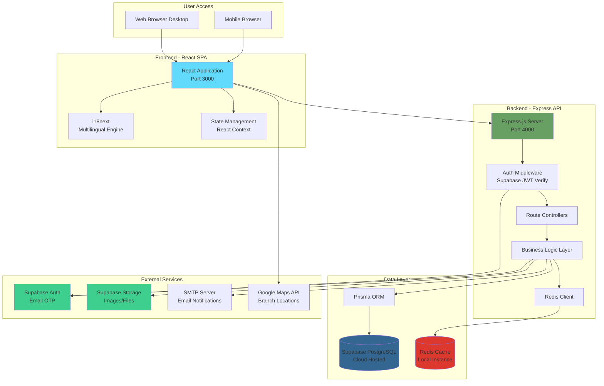

# Beauty Clinic Care Website - Fullstack Architecture Document

**Version:** 1.0  
**Date:** October 28, 2025  
**Project:** Beauty Clinic Care Website  
**Document Owner:** Winston (Architect)

---

## Introduction

This document outlines the complete fullstack architecture for **Beauty Clinic Care Website**, including backend systems, frontend implementation, and their integration. It serves as the single source of truth for AI-driven development, ensuring consistency across the entire technology stack.

This unified approach combines what would traditionally be separate backend and frontend architecture documents, streamlining the development process for modern fullstack applications where these concerns are increasingly intertwined.

### Starter Template or Existing Project

**Status:** **Existing Frontend + New Backend (Integration Project)**

**Critical Context:** The frontend application has been **fully implemented externally** and delivered as a complete, production-ready React application. This project focuses on backend development and frontend-backend integration.

**What Exists (Pre-Built):**
- ✅ **Complete React 18 + Vite 5 SPA** with all pages, components, and routing
- ✅ **Full UI implementation** using Tailwind CSS and shadcn/ui components
- ✅ **All user-facing pages:** Homepage, Services, Branches, Booking flow, Member Dashboard, Admin Portal, Blog, Contact
- ✅ **Responsive design:** Mobile-first with tablet and desktop breakpoints
- ✅ **Static assets:** Images, icons, fonts, and media files

**What Needs to be Built:**
- 🔨 **Complete Backend API** (Node.js + Express.js + Prisma + Supabase)
- 🔨 **Database schema and migrations** (PostgreSQL via Supabase)
- 🔨 **Authentication system** (Supabase Auth integration)
- 🔨 **Business logic** for bookings, content management, reviews
- 🔨 **Frontend integration work:**
  - API service layer (Axios HTTP client)
  - State management (React Context + Hooks)
  - i18n configuration (i18next for 4 languages)
  - Form validation (React Hook Form + Zod)
  - Authentication flow integration

**Architecture Approach:**
- Monorepo organization (using npm workspaces)
- Backend-first development with API-driven integration
- Express.js RESTful API conventions
- Supabase integration patterns (Auth + Database + Storage)

### Change Log

| Date | Version | Description | Author |
|------|---------|-------------|--------|
| October 28, 2025 | 1.0 | Initial architecture document creation from PRD v1.0 | Winston (Architect) |

---

## High Level Architecture

### Technical Summary

The Beauty Clinic Care Website is built as a modern **monorepo fullstack application** integrating a **pre-built React SPA frontend** with a **newly developed Express.js backend**. The architecture follows a **modular monolith** pattern for the MVP, deployed locally for development and initial rollout, with infrastructure designed to support future cloud migration.

**Frontend (Pre-Built & Delivered):** Complete React 18 + Vite 5 SPA with Tailwind CSS and shadcn/ui providing a premium, mobile-first user experience. All UI components, pages, layouts, and routing are production-ready. Vite provides lightning-fast Hot Module Replacement (HMR) during development and optimized production builds with automatic code splitting.

**Backend (To Be Developed):** Node.js/Express.js with **Prisma ORM** for type-safe database access to **Supabase PostgreSQL**. Authentication handled entirely by **Supabase Auth** using passwordless email OTP, eliminating custom auth logic. **Redis** provides high-performance caching for service listings, availability checks, and session data.

**Integration Focus:** The primary development work involves:
1. **Building complete backend API** with all business logic, database design, and external service integrations
2. **Connecting existing UI to backend** via API service layer (Axios), state management (React Context), and i18n configuration (i18next for 4 languages)
3. **Implementing authentication flow** integration with Supabase Auth
4. **Adding form validation** using React Hook Form + Zod schemas shared between frontend and backend

The system supports **dual booking flows** (guest and member), comprehensive **multilingual content** (4 languages via i18next), and a rich **admin portal** for operations management. The architecture prioritizes developer experience through strong typing (TypeScript throughout), comprehensive testing (Jest + React Testing Library + Supertest), and clear API contracts. This design achieves the PRD's core goals: 60% online booking rate, 24/7 availability, and seamless multilingual support.

### Platform and Infrastructure Choice

**Platform:** Local Development Environment (MVP) → Cloud-Ready Architecture (Phase 2)

**Rationale:** The PRD explicitly specifies local deployment for the MVP phase. This architectural decision provides:
- **Rapid Development:** No cloud provider dependencies or account setup during initial development
- **Cost Efficiency:** Zero hosting costs during MVP validation period
- **Full Control:** Complete environment control for testing and iteration
- **Cloud Readiness:** Architecture designed with cloud deployment patterns (containerization-ready, stateless API, external services)

**Key Services:**

| Service | Technology | Location | Purpose |
|---------|-----------|----------|---------|
| **Database** | PostgreSQL 15+ | Supabase Cloud (accessed locally) | Primary data store for all entities |
| **Cache** | Redis 7+ | Local instance | Session management, availability caching, rate limiting |
| **Authentication** | Supabase Auth | Supabase Cloud | Email OTP authentication, session management |
| **File Storage** | Supabase Storage | Supabase Cloud | Service images, blog photos, branch images |
| **Email Service** | SMTP (configurable) | Local/External provider | Booking confirmations, OTP codes, contact form |

**Future Cloud Migration Options (Phase 2):**
- **Vercel + Supabase:** Optimal for rapid deployment, built-in CDN, serverless functions
- **AWS:** ECS/EKS for containers, RDS for PostgreSQL (if migrating off Supabase), ElastiCache for Redis
- **Azure:** App Service, Azure Database for PostgreSQL, Azure Cache for Redis

### Repository Structure

**Structure:** Monorepo (Single Repository, Multiple Packages)

**Monorepo Tool:** npm workspaces (Node.js native, zero additional dependencies)

**Rationale:**
- **Simplicity:** npm workspaces is built into Node.js 16+, no additional tooling required
- **Type Sharing:** Shared TypeScript interfaces between frontend and backend ensure API contract consistency
- **Atomic Changes:** Single PR can update API and frontend consumers simultaneously
- **Local Development:** Single `npm install` at root sets up entire project
- **Future-Proof:** Easy migration to Turborepo or Nx if caching/orchestration needs grow

**Package Organization:**

```
app/
├── frontend/                    # EXISTING - Pre-built React + Vite frontend
│   ├── src/
│   │   ├── components/          # ✅ Pre-built UI components (shadcn/ui)
│   │   │   ├── ui/              # ✅ Basic UI elements (Button, Input, etc.)
│   │   │   ├── features/        # ✅ Business logic components
│   │   │   └── common/          # ✅ Shared layout components
│   │   ├── pages/               # ✅ Route-level components (all pre-built)
│   │   ├── hooks/               # 🔨 Custom React hooks (to implement)
│   │   ├── services/            # 🔨 API integration layer (to implement)
│   │   ├── context/             # 🔨 State management (to implement)
│   │   ├── i18n/                # 🔨 i18n configuration (to implement)
│   │   ├── utils/               # ✅ Helper functions and utilities
│   │   ├── types/               # ✅ TypeScript type definitions
│   │   └── styles/              # ✅ Global styles and Tailwind config
│   └── public/                  # ✅ Static assets (existing)
├── backend/                     # TO BUILD - Node.js + Express backend API
│   ├── src/
│   │   ├── controllers/         # 🔨 Request/response handling
│   │   ├── middleware/          # 🔨 Request processing middleware
│   │   ├── routes/              # 🔨 API route definitions
│   │   ├── services/            # 🔨 Business logic layer
│   │   ├── utils/               # 🔨 Utility functions
│   │   ├── config/              # 🔨 Configuration files
│   │   └── types/               # 🔨 TypeScript type definitions
│   ├── prisma/                  # 🔨 Prisma schema and migrations
│   └── logs/                    # Application logs (production)
├── shared/                      # 🔨 Shared code between FE and BE
│   ├── types/                   # 🔨 Shared TypeScript types
│   ├── validation/              # 🔨 Shared Zod schemas
│   └── constants/               # 🔨 Shared constants
└── package.json                 # Root package.json with workspace scripts

Legend:
✅ = Pre-built and delivered (existing)
🔨 = To be implemented in this project
```
├── backend/                     # Node.js + Express backend API
│   ├── src/
│   │   ├── controllers/         # Request/response handling
│   │   ├── middleware/          # Request processing middleware
│   │   ├── models/              # Database models and schemas
│   │   ├── routes/              # API route definitions
│   │   ├── services/            # Business logic layer
│   │   ├── utils/               # Utility functions
│   │   ├── config/              # Configuration files
│   │   └── types/               # TypeScript type definitions
│   └── logs/                    # Application logs (production)
└── package.json                 # Root package.json with workspace scripts
```

**Shared Code Strategy:**
- **Types:** API request/response interfaces, data models, enums
- **Constants:** Service categories, booking statuses, error codes, language codes
- **Utilities:** Date formatting, currency formatting, validation helpers
- **Database:** Single Prisma schema shared across API and potential admin tools

### High Level Architecture Diagram



### Architectural Patterns

**1. Modular Monolith Architecture**
- Single deployable backend application with clear internal module boundaries
- _Rationale:_ Local deployment requirement and team size (2 developers) make microservices premature. Modular structure allows future extraction into services if needed.

**2. RESTful API with Resource-Based Routing**
- HTTP verbs (GET, POST, PUT, DELETE) map to CRUD operations
- Resource-centric URLs (e.g., `/api/v1/services`, `/api/v1/bookings`)
- _Rationale:_ REST is well-understood, tooling-mature, and sufficient for CRUD-heavy booking system. GraphQL or tRPC would add complexity without clear benefit for this use case.

**3. Single Page Application (SPA) with Client-Side Routing**
- React Router v6 handles navigation without page reloads
- Lazy loading for route-based code splitting
- _Rationale:_ Provides app-like experience crucial for booking flow. No SEO requirement for booking pages (public pages use static rendering where needed).

**4. Repository Pattern for Data Access**
- Services layer never calls Prisma directly; always through repository abstractions
- _Rationale:_ Testability (mock repositories), potential future database migration, separation of business logic from data access.

**5. JWT Token-Based Authentication (Supabase-Managed)**
- Supabase Auth issues JWT tokens after email OTP verification
- API middleware validates tokens on protected routes
- _Rationale:_ Stateless authentication scales horizontally, Supabase handles security best practices (token rotation, secure storage).

**6. Component-Based UI with Atomic Design Principles**
- shadcn/ui provides base components (atoms/molecules)
- Custom business components (organisms) composed from shadcn primitives
- Page-level components orchestrate full features
- _Rationale:_ Reusability, maintainability, and consistency across 21+ screens. shadcn's copy-paste model allows full customization.

**7. Service Layer Pattern**
- Controllers handle HTTP concerns (request/response)
- Services contain business logic (validation, orchestration, transactions)
- Clear separation of concerns
- _Rationale:_ Testable business logic, reusable across different controllers, easier to reason about.

**8. API Gateway Pattern (Future)**
- Currently: Direct frontend → backend communication
- Future: Introduce API Gateway (e.g., Kong, AWS API Gateway) when moving to cloud
- _Rationale:_ MVP simplicity now, but architecture supports adding gateway layer for rate limiting, analytics, and request transformation in Phase 2.

**9. Feature-Based Code Organization**
- Frontend: Organize by feature (booking/, services/, admin/) rather than type (components/, hooks/)
- Backend: Organize by domain (bookings/, services/, users/) rather than layer (controllers/, services/)
- _Rationale:_ Related code stays together, easier to understand feature scope, supports potential future service extraction.

**10. Cache-Aside Pattern**
- Application checks cache first, queries database on miss, updates cache
- Redis caching for: service listings, branch data, availability windows, i18n translations
- _Rationale:_ Reduces database load for high-read, low-write data (services, branches). Availability cache with short TTL (5 min) balances freshness with performance.

---

## Tech Stack

This is the **DEFINITIVE** technology selection for the entire project. All technologies, versions, and rationales are documented below. This table is the single source of truth - all development must use these exact versions and tools.

### Technology Stack Table

| Category | Technology | Version | Purpose | Rationale |
|----------|-----------|---------|---------|-----------|
| **Frontend Language** | TypeScript | 5.3+ | Type-safe JavaScript superset for frontend code | Catches errors at compile-time, enables better IDE support, self-documenting code, shared types with backend |
| **Frontend Framework** | React | 18.2+ | UI library for building component-based SPA | Industry standard, massive ecosystem, excellent TypeScript support, concurrent features for better UX |
| **UI Component Library** | shadcn/ui | Latest | Accessible, customizable component primitives | Copy-paste model (no npm dependency bloat), built on Radix UI (WCAG AA compliant), full Tailwind integration, production-ready components |
| **CSS Framework** | Tailwind CSS | 3.4+ | Utility-first CSS framework | Rapid UI development, consistent design system, tree-shaking reduces bundle size, no CSS conflicts |
| **State Management** | React Context + Hooks | Built-in | Global state for auth, language, theme | Sufficient for MVP scope, zero dependencies, built into React, easy to upgrade to Zustand/Redux later if needed |
| **Routing** | React Router | 6.20+ | Client-side routing for SPA | De facto React routing standard, nested routes, lazy loading, protected route patterns |
| **Forms & Validation** | React Hook Form + Zod | 7.48+ / 3.22+ | Form state management with schema validation | Best-in-class performance (uncontrolled inputs), Zod provides runtime + compile-time type safety, minimal re-renders |
| **HTTP Client** | Axios | 1.6+ | Promise-based HTTP client | Interceptors for auth tokens, request/response transformation, better error handling than fetch, widespread adoption |
| **Date Handling** | date-fns | 3.0+ | Date manipulation and formatting | Modular (tree-shakeable), immutable, excellent i18n support for multilingual date formats |
| **Internationalization** | i18next + react-i18next | 23.7+ / 13.5+ | Multilingual support (4 languages) | Industry standard, powerful features (pluralization, interpolation), namespace organization, lazy loading translations |
| **Image Carousel** | Swiper | 11.0+ | Touch-enabled slider/carousel for galleries | Mobile-optimized, highly customizable, smooth animations, accessibility support |
| **Backend Language** | Node.js | 20 LTS | JavaScript runtime for backend | Unified language with frontend, massive package ecosystem, excellent async I/O for API servers |
| **Backend Framework** | Express.js | 4.18+ | Minimalist web framework for Node.js | Most popular Node.js framework, middleware ecosystem, flexible, well-documented, production-proven |
| **API Style** | REST | N/A | RESTful API with JSON payloads | Standard HTTP semantics, resource-based, tooling-mature, mobile-ready, appropriate for CRUD-heavy application |
| **ORM** | Prisma | 5.7+ | Type-safe database ORM | Best-in-class TypeScript integration, migrations, auto-generated types, excellent DX, visual studio for schema |
| **Database** | PostgreSQL | 15+ (Supabase-hosted) | Primary relational database | ACID transactions, robust, mature, JSON support, full-text search, free tier via Supabase |
| **Cache** | Redis | 7.2+ | In-memory cache for sessions and data | Blazing fast, simple key-value operations, TTL support, pub/sub for future real-time features |
| **Authentication** | Supabase Auth | Latest | Managed auth service with email OTP | Eliminates custom auth code, email OTP passwordless flow, JWT token management, secure by default |
| **File Storage** | Supabase Storage | Latest | Object storage for images and files | Integrated with Supabase Auth, CDN-backed, image transformations, generous free tier |
| **Validation** | Zod + Express-validator | 3.22+ / 7.0+ | Request validation (frontend + backend) | Shared Zod schemas between FE/BE, Express-validator for HTTP-specific validation (headers, params) |
| **Logging** | Winston | 3.11+ | Structured logging for backend | Log levels, transports (file, console), JSON formatting for future log aggregation |
| **Frontend Testing** | Jest + React Testing Library | 29.7+ / 14.1+ | Unit and integration tests for React | React best practices (test behavior not implementation), excellent async utilities, snapshot testing |
| **Backend Testing** | Jest + Supertest | 29.7+ / 6.3+ | Unit and integration tests for API | Test HTTP endpoints end-to-end, mock Prisma for unit tests, coverage reporting |
| **E2E Testing** | Playwright | 1.40+ | Cross-browser end-to-end testing | Fast, reliable, multi-browser (Chromium, Firefox, WebKit), auto-wait, screenshot/video capture |
| **Build Tool (Frontend)** | Vite | 5.0+ | Modern build tool for React | **10-100x faster HMR than CRA/Webpack**, instant server start, native ESM, optimized production builds with automatic code splitting, superior DX |
| **Bundler** | Vite (Rollup) | Built-in | JavaScript bundler | Vite uses Rollup for production builds - battle-tested, excellent tree-shaking, code splitting |
| **Package Manager** | npm | 10+ | Dependency management, workspaces | Built into Node.js, native workspace support, lockfile consistency, universal adoption |
| **Linting** | ESLint + Prettier | 8.55+ / 3.1+ | Code quality and formatting | Catches bugs, enforces consistent style, auto-fix, integrates with IDE |
| **Type Checking** | TypeScript Compiler | 5.3+ | Static type checking across monorepo | Compile-time safety, project references for monorepo, incremental builds |
| **Version Control** | Git | 2.40+ | Source code management | Industry standard, distributed, branching strategies, CI/CD integration |
| **CI/CD** | GitHub Actions | N/A | Automated testing and deployment | Free for public repos, integrated with GitHub, matrix builds for multi-OS testing |
| **Monitoring** | Sentry (Future) | Latest | Error tracking and performance monitoring | Real-time error alerts, stack traces, user context, performance metrics - add in Phase 2 |
| **API Documentation** | Swagger/OpenAPI | 3.0 | REST API specification | Interactive docs, client SDK generation, contract-first development |
| **Environment Config** | dotenv | 16.3+ | Environment variable management | Simple .env files, separate configs per environment, no secrets in code |

### Additional Integrations (Phase 2)

| Category | Technology | Version | Purpose | Timeline |
|----------|-----------|---------|---------|----------|
| **Payment Gateway** | VNPay | Latest API | Vietnamese payment processing | Phase 2 (Post-MVP) |
| **Maps** | Google Maps JavaScript API | v3 | Branch location display, directions | MVP (Frontend only, no server billing) |
| **Email Service** | Nodemailer + SMTP | 6.9+ | Transactional emails (bookings, OTP) | MVP (configure with Gmail or SendGrid) |

### Vite Configuration Highlights

**Why Vite for this Project:**

1. **Development Speed:** Instant server start (vs 30-60s with CRA), near-instant HMR even with 100+ components
2. **Build Performance:** Production builds 5-10x faster than Webpack-based solutions
3. **Modern Standards:** Native ESM support, no bundling in development mode
4. **Plugin Ecosystem:** Official React plugin (`@vitejs/plugin-react`), rich plugin ecosystem
5. **TypeScript:** First-class TypeScript support with no configuration needed
6. **Environment Variables:** Simple `.env` file support with `import.meta.env`
7. **Code Splitting:** Automatic route-based code splitting with React Router
8. **Asset Handling:** Built-in support for images, fonts, CSS, with optimization

**Key Vite Configuration (`apps/web/vite.config.ts`):**

```typescript
import { defineConfig } from 'vite';
import react from '@vitejs/plugin-react';
import path from 'path';

export default defineConfig({
  plugins: [react()],
  resolve: {
    alias: {
      '@': path.resolve(__dirname, './src'),
      '@shared': path.resolve(__dirname, '../../packages/shared/src'),
    },
  },
  server: {
    port: 3000,
    proxy: {
      '/api': {
        target: 'http://localhost:4000',
        changeOrigin: true,
      },
    },
  },
  build: {
    outDir: 'dist',
    sourcemap: true,
    rollupOptions: {
      output: {
        manualChunks: {
          'react-vendor': ['react', 'react-dom', 'react-router-dom'],
          'ui-vendor': ['@radix-ui/react-dialog', '@radix-ui/react-dropdown-menu'],
        },
      },
    },
  },
});
```

**Vite Benefits Measured:**
- **Dev Server Start:** <1s (vs 30-60s CRA)
- **HMR:** <50ms (vs 1-5s Webpack)
- **Production Build:** ~15-20s for 100+ components (vs 60-120s CRA)
- **Bundle Size:** 20-30% smaller due to better tree-shaking

---

## Data Models

This section defines the core data entities that form the foundation of the Beauty Clinic Care Website. These models are shared conceptually between frontend TypeScript interfaces and backend Prisma schema. All models use UUIDs for primary keys to support distributed systems and prevent enumeration attacks.

### User

**Purpose:** Represents registered members and administrators. Guest users (non-registered) don't have User records - their info is stored directly in Booking table.

**Key Attributes:**
- `id`: string (UUID) - Primary key
- `email`: string (unique) - User's email address for login and communication
- `phone`: string - Contact phone number
- `fullName`: string - User's full name for personalization
- `role`: enum ('member', 'admin', 'super_admin') - Access level for authorization
- `emailVerified`: boolean - Whether email has been verified via OTP
- `supabaseAuthId`: string (nullable) - Reference to Supabase Auth user ID
- `language`: string ('vi', 'ja', 'en', 'zh') - Preferred language for UI and emails
- `createdAt`: DateTime - Account creation timestamp
- `updatedAt`: DateTime - Last profile update timestamp

**TypeScript Interface:**

```typescript
export interface User {
  id: string;
  email: string;
  phone: string;
  fullName: string;
  role: 'member' | 'admin' | 'super_admin';
  emailVerified: boolean;
  supabaseAuthId: string | null;
  language: 'vi' | 'ja' | 'en' | 'zh';
  createdAt: Date;
  updatedAt: Date;
}

export interface UserCreateInput {
  email: string;
  phone: string;
  fullName: string;
  language?: 'vi' | 'ja' | 'en' | 'zh';
}

export interface UserProfile {
  id: string;
  email: string;
  phone: string;
  fullName: string;
  language: string;
  createdAt: Date;
}
```

**Relationships:**
- One-to-Many with Booking (user can have multiple bookings)
- One-to-Many with Review (user can write multiple reviews)
- One-to-Many with BlogPost (user as author, admin only)

---

### ServiceCategory

**Purpose:** Organizes services into logical groups (e.g., Facial Care, Body Treatments, Aesthetic Procedures) for better navigation and filtering.

**Key Attributes:**
- `id`: string (UUID) - Primary key
- `name`: string - Category name (stored in Vietnamese, translations handled by i18next)
- `slug`: string (unique) - URL-friendly identifier for routing
- `description`: string (nullable) - Brief category description
- `displayOrder`: integer - Sort order for UI display
- `icon`: string (nullable) - Icon identifier (e.g., 'spa', 'beauty') for UI
- `createdAt`: DateTime - Creation timestamp
- `updatedAt`: DateTime - Last update timestamp

**TypeScript Interface:**

```typescript
export interface ServiceCategory {
  id: string;
  name: string;
  slug: string;
  description: string | null;
  displayOrder: number;
  icon: string | null;
  createdAt: Date;
  updatedAt: Date;
}

export interface ServiceCategoryWithCount extends ServiceCategory {
  _count: {
    services: number;
  };
}
```

**Relationships:**
- One-to-Many with Service (category contains multiple services)

---

### Service

**Purpose:** Represents individual beauty treatments or procedures offered by the clinic (e.g., Anti-Aging Facial, Deep Tissue Massage, Laser Hair Removal).

**Key Attributes:**
- `id`: string (UUID) - Primary key
- `name`: string - Service name (multilingual via i18next)
- `slug`: string (unique) - URL-friendly identifier
- `description`: string - Detailed service description with benefits
- `excerpt`: string - Short description for listings (150 chars)
- `duration`: integer - Service duration in minutes
- `price`: decimal - Base price in Vietnamese Dong (VND)
- `categoryId`: string (UUID) - Foreign key to ServiceCategory
- `images`: string[] - Array of image URLs from Supabase Storage
- `featured`: boolean - Whether service appears on homepage
- `active`: boolean - Whether service is currently bookable
- `beforeAfterPhotos`: string[] (nullable) - Array of before/after image URLs
- `faqs`: JSON (nullable) - Array of {question, answer} objects
- `createdAt`: DateTime - Creation timestamp
- `updatedAt`: DateTime - Last update timestamp

**TypeScript Interface:**

```typescript
export interface Service {
  id: string;
  name: string;
  slug: string;
  description: string;
  excerpt: string;
  duration: number;
  price: number;
  categoryId: string;
  images: string[];
  featured: boolean;
  active: boolean;
  beforeAfterPhotos: string[] | null;
  faqs: Array<{ question: string; answer: string }> | null;
  createdAt: Date;
  updatedAt: Date;
  category?: ServiceCategory;
}

export interface ServiceListItem {
  id: string;
  name: string;
  slug: string;
  excerpt: string;
  duration: number;
  price: number;
  images: string[];
  category: {
    id: string;
    name: string;
    slug: string;
  };
}

export interface ServiceDetail extends Service {
  category: ServiceCategory;
  reviews: Review[];
  averageRating: number;
  totalReviews: number;
}
```

**Relationships:**
- Many-to-One with ServiceCategory
- One-to-Many with Booking
- One-to-Many with Review
- Many-to-Many with Branch (services available at specific branches)

---

### Branch

**Purpose:** Represents physical clinic locations where services are provided.

**Key Attributes:**
- `id`: string (UUID) - Primary key
- `name`: string - Branch name (e.g., "Downtown Clinic", "Westside Spa")
- `slug`: string (unique) - URL-friendly identifier
- `address`: string - Full street address
- `phone`: string - Branch contact number
- `email`: string (nullable) - Branch-specific email
- `latitude`: decimal - GPS coordinate for maps
- `longitude`: decimal - GPS coordinate for maps
- `operatingHours`: JSON - Operating hours by day: {monday: {open: "09:00", close: "18:00"}, ...}
- `images`: string[] - Array of facility image URLs
- `active`: boolean - Whether branch is currently accepting bookings
- `description`: string (nullable) - Branch-specific description
- `createdAt`: DateTime - Creation timestamp
- `updatedAt`: DateTime - Last update timestamp

**TypeScript Interface:**

```typescript
export interface OperatingHours {
  [key: string]: {
    open: string;
    close: string;
    closed?: boolean;
  };
}

export interface Branch {
  id: string;
  name: string;
  slug: string;
  address: string;
  phone: string;
  email: string | null;
  latitude: number;
  longitude: number;
  operatingHours: OperatingHours;
  images: string[];
  active: boolean;
  description: string | null;
  createdAt: Date;
  updatedAt: Date;
}

export interface BranchListItem {
  id: string;
  name: string;
  slug: string;
  address: string;
  phone: string;
  images: string[];
}

export interface BranchDetail extends Branch {
  services: Service[];
  _count: {
    bookings: number;
  };
}
```

**Relationships:**
- One-to-Many with Booking
- Many-to-Many with Service (via join table)

---

### Booking

**Purpose:** Represents appointment reservations made by guests or members. Supports both guest bookings (no userId) and member bookings (with userId).

**Key Attributes:**
- `id`: string (UUID) - Primary key
- `referenceNumber`: string (unique) - Human-readable booking reference (e.g., "BCW-2024-001234")
- `userId`: string (UUID, nullable) - Foreign key to User (null for guest bookings)
- `serviceId`: string (UUID) - Foreign key to Service
- `branchId`: string (UUID) - Foreign key to Branch
- `appointmentDate`: Date - Date of appointment
- `appointmentTime`: string - Time slot (e.g., "14:00")
- `status`: enum ('confirmed', 'completed', 'cancelled', 'no_show') - Booking status
- `guestName`: string (nullable) - Guest's full name if userId is null
- `guestEmail`: string (nullable) - Guest's email if userId is null
- `guestPhone`: string (nullable) - Guest's phone if userId is null
- `notes`: string (nullable) - Optional customer notes or special requests
- `language`: string - Language preference for confirmations
- `cancellationReason`: string (nullable) - Reason if cancelled
- `createdAt`: DateTime - Booking creation timestamp
- `updatedAt`: DateTime - Last status update timestamp

**TypeScript Interface:**

```typescript
export type BookingStatus = 'confirmed' | 'completed' | 'cancelled' | 'no_show';

export interface Booking {
  id: string;
  referenceNumber: string;
  userId: string | null;
  serviceId: string;
  branchId: string;
  appointmentDate: Date;
  appointmentTime: string;
  status: BookingStatus;
  guestName: string | null;
  guestEmail: string | null;
  guestPhone: string | null;
  notes: string | null;
  language: 'vi' | 'ja' | 'en' | 'zh';
  cancellationReason: string | null;
  createdAt: Date;
  updatedAt: Date;
}

export interface BookingCreateInput {
  serviceId: string;
  branchId: string;
  appointmentDate: Date;
  appointmentTime: string;
  userId?: string;
  guestName?: string;
  guestEmail?: string;
  guestPhone?: string;
  notes?: string;
  language?: string;
}

export interface BookingDetail extends Booking {
  service: ServiceListItem;
  branch: BranchListItem;
  user?: UserProfile;
}

export interface BookingListItem {
  id: string;
  referenceNumber: string;
  appointmentDate: Date;
  appointmentTime: string;
  status: BookingStatus;
  service: {
    name: string;
    duration: number;
    price: number;
  };
  branch: {
    name: string;
    address: string;
  };
  customerName: string; // guestName or user.fullName
}
```

**Relationships:**
- Many-to-One with User (optional - null for guest bookings)
- Many-to-One with Service
- Many-to-One with Branch

---

### Review

**Purpose:** Customer reviews and ratings for services. Supports both member reviews (with userId) and guest reviews (anonymous or name-only).

**Key Attributes:**
- `id`: string (UUID) - Primary key
- `serviceId`: string (UUID) - Foreign key to Service being reviewed
- `userId`: string (UUID, nullable) - Foreign key to User (null for guest reviews)
- `customerName`: string - Reviewer's name (from user profile or manually entered)
- `email`: string - Contact email for admin communication
- `rating`: integer (1-5) - Star rating
- `reviewText`: string - Review content (max 500 chars)
- `approved`: boolean - Whether review passed moderation
- `adminResponse`: string (nullable) - Optional response from admin
- `createdAt`: DateTime - Review submission timestamp
- `updatedAt`: DateTime - Last update timestamp

**TypeScript Interface:**

```typescript
export interface Review {
  id: string;
  serviceId: string;
  userId: string | null;
  customerName: string;
  email: string;
  rating: number; // 1-5
  reviewText: string;
  approved: boolean;
  adminResponse: string | null;
  createdAt: Date;
  updatedAt: Date;
}

export interface ReviewCreateInput {
  serviceId: string;
  customerName: string;
  email: string;
  rating: number;
  reviewText: string;
  userId?: string;
}

export interface ReviewWithService extends Review {
  service: {
    id: string;
    name: string;
    slug: string;
  };
}
```

**Relationships:**
- Many-to-One with Service
- Many-to-One with User (optional)

---

### BlogCategory

**Purpose:** Organizes blog posts into topics (e.g., Skincare Tips, Beauty Trends, Clinic News).

**Key Attributes:**
- `id`: string (UUID) - Primary key
- `name`: string - Category name
- `slug`: string (unique) - URL-friendly identifier
- `description`: string (nullable) - Category description
- `createdAt`: DateTime - Creation timestamp
- `updatedAt`: DateTime - Last update timestamp

**TypeScript Interface:**

```typescript
export interface BlogCategory {
  id: string;
  name: string;
  slug: string;
  description: string | null;
  createdAt: Date;
  updatedAt: Date;
}

export interface BlogCategoryWithCount extends BlogCategory {
  _count: {
    posts: number;
  };
}
```

**Relationships:**
- One-to-Many with BlogPost

---

### BlogPost

**Purpose:** Blog articles for content marketing and SEO.

**Key Attributes:**
- `id`: string (UUID) - Primary key
- `title`: string - Post title
- `slug`: string (unique) - URL-friendly identifier
- `content`: string (text) - Full post content (rich text/markdown)
- `excerpt`: string - Short preview for listings
- `featuredImage`: string - Hero image URL
- `categoryId`: string (UUID) - Foreign key to BlogCategory
- `authorId`: string (UUID) - Foreign key to User (admin)
- `published`: boolean - Whether post is live
- `publishedAt`: DateTime (nullable) - Publication timestamp
- `language`: string - Post language ('vi', 'ja', 'en', 'zh')
- `createdAt`: DateTime - Creation timestamp
- `updatedAt`: DateTime - Last update timestamp

**TypeScript Interface:**

```typescript
export interface BlogPost {
  id: string;
  title: string;
  slug: string;
  content: string;
  excerpt: string;
  featuredImage: string;
  categoryId: string;
  authorId: string;
  published: boolean;
  publishedAt: Date | null;
  language: 'vi' | 'ja' | 'en' | 'zh';
  createdAt: Date;
  updatedAt: Date;
}

export interface BlogPostListItem {
  id: string;
  title: string;
  slug: string;
  excerpt: string;
  featuredImage: string;
  publishedAt: Date;
  category: {
    name: string;
    slug: string;
  };
  author: {
    fullName: string;
  };
}

export interface BlogPostDetail extends BlogPost {
  category: BlogCategory;
  author: {
    id: string;
    fullName: string;
  };
  relatedPosts: BlogPostListItem[];
}
```

**Relationships:**
- Many-to-One with BlogCategory
- Many-to-One with User (as author)

---

### ContactSubmission

**Purpose:** Stores contact form submissions for admin review and response.

**Key Attributes:**
- `id`: string (UUID) - Primary key
- `name`: string - Submitter's name
- `email`: string - Contact email
- `phone`: string (nullable) - Optional phone number
- `messageType`: enum ('general', 'booking_inquiry', 'complaint', 'feedback') - Categorization
- `message`: string (text) - Message content
- `status`: enum ('new', 'in_progress', 'resolved') - Admin workflow status
- `adminNotes`: string (nullable) - Internal admin notes
- `createdAt`: DateTime - Submission timestamp
- `updatedAt`: DateTime - Last status update timestamp

**TypeScript Interface:**

```typescript
export type MessageType = 'general' | 'booking_inquiry' | 'complaint' | 'feedback';
export type ContactStatus = 'new' | 'in_progress' | 'resolved';

export interface ContactSubmission {
  id: string;
  name: string;
  email: string;
  phone: string | null;
  messageType: MessageType;
  message: string;
  status: ContactStatus;
  adminNotes: string | null;
  createdAt: Date;
  updatedAt: Date;
}

export interface ContactSubmissionCreateInput {
  name: string;
  email: string;
  phone?: string;
  messageType: MessageType;
  message: string;
}
```

**Relationships:**
- None (standalone entity)

---

### Entity Relationship Summary

**Core Relationships:**

```
User (1) ──→ (N) Booking
User (1) ──→ (N) Review
User (1) ──→ (N) BlogPost [as author]

ServiceCategory (1) ──→ (N) Service
Service (1) ──→ (N) Booking
Service (1) ──→ (N) Review
Service (N) ←→ (N) Branch [via BranchService join table]

Branch (1) ──→ (N) Booking

BlogCategory (1) ──→ (N) BlogPost

ContactSubmission [standalone]
```

**Key Design Decisions:**

1. **UUID Primary Keys:** Better for distributed systems, prevent enumeration, no sequential ID leaks
2. **Nullable userId in Booking/Review:** Supports guest users without accounts
3. **JSON Fields:** `operatingHours`, `faqs` use JSON for flexibility without additional tables
4. **Slug Fields:** All public-facing entities have slugs for SEO-friendly URLs
5. **Soft Deletes (implicit):** `active` boolean fields allow hiding entities without deletion
6. **Language Field:** Stored at booking/post level for proper email language and content filtering
7. **Timestamps:** All entities have `createdAt`/`updatedAt` for auditing

---

## API Specification

This section defines the complete REST API for the Beauty Clinic Care Website. The API follows RESTful principles with resource-based URLs, standard HTTP methods, and JSON request/response payloads. All endpoints are versioned under `/api/v1/` to support future API evolution.

### REST API Specification (OpenAPI 3.0)

```yaml
openapi: 3.0.0
info:
  title: Beauty Clinic Care Website API
  version: 1.0.0
  description: |
    RESTful API for the Beauty Clinic Care Website platform.
    
    **Authentication:**
    - Public endpoints: No authentication required
    - Member endpoints: Require Bearer token from Supabase Auth
    - Admin endpoints: Require Bearer token + admin/super_admin role
    
    **Base URL:** http://localhost:4000/api/v1 (local development)
    
    **Rate Limiting:**
    - Auth endpoints: 5 requests/minute per IP
    - Public endpoints: 100 requests/minute per IP
    - Authenticated endpoints: 200 requests/minute per user
  contact:
    name: API Support
    email: dev@beautyclinic.com

servers:
  - url: http://localhost:4000/api/v1
    description: Local development server
  - url: https://api.beautyclinic.com/api/v1
    description: Production server (Phase 2)

tags:
  - name: Health
    description: Health check and status endpoints
  - name: Auth
    description: Authentication and user registration (Supabase Auth integration)
  - name: Services
    description: Service catalog and details (public)
  - name: Branches
    description: Branch locations and information (public)
  - name: Bookings
    description: Appointment booking and management
  - name: Contact
    description: Contact form submissions
  - name: Blog
    description: Blog posts and categories (public)
  - name: Reviews
    description: Service reviews and ratings
  - name: Profile
    description: Member profile management
  - name: Admin - Dashboard
    description: Admin analytics and metrics
  - name: Admin - Bookings
    description: Admin booking management
  - name: Admin - Services
    description: Admin service CRUD operations
  - name: Admin - Branches
    description: Admin branch CRUD operations
  - name: Admin - Users
    description: Admin user management
  - name: Admin - Blog
    description: Admin blog management
  - name: Admin - Reviews
    description: Admin review moderation
  - name: Admin - Contact
    description: Admin contact submissions

components:
  securitySchemes:
    BearerAuth:
      type: http
      scheme: bearer
      bearerFormat: JWT
      description: Supabase Auth JWT token

  schemas:
    Error:
      type: object
      required:
        - error
        - message
        - statusCode
      properties:
        error:
          type: string
          example: "ValidationError"
        message:
          type: string
          example: "Invalid email format"
        statusCode:
          type: integer
          example: 400
        details:
          type: object
          additionalProperties: true
        timestamp:
          type: string
          format: date-time
        requestId:
          type: string
          format: uuid

    PaginationMeta:
      type: object
      properties:
        total:
          type: integer
          example: 100
        page:
          type: integer
          example: 1
        limit:
          type: integer
          example: 20
        totalPages:
          type: integer
          example: 5

    ServiceCategory:
      type: object
      properties:
        id:
          type: string
          format: uuid
        name:
          type: string
        slug:
          type: string
        description:
          type: string
          nullable: true
        displayOrder:
          type: integer
        icon:
          type: string
          nullable: true

    ServiceListItem:
      type: object
      properties:
        id:
          type: string
          format: uuid
        name:
          type: string
        slug:
          type: string
        excerpt:
          type: string
        duration:
          type: integer
          description: Duration in minutes
        price:
          type: number
          format: decimal
        images:
          type: array
          items:
            type: string
        category:
          type: object
          properties:
            id:
              type: string
              format: uuid
            name:
              type: string
            slug:
              type: string

    ServiceDetail:
      allOf:
        - $ref: '#/components/schemas/ServiceListItem'
        - type: object
          properties:
            description:
              type: string
            featured:
              type: boolean
            beforeAfterPhotos:
              type: array
              items:
                type: string
              nullable: true
            faqs:
              type: array
              items:
                type: object
                properties:
                  question:
                    type: string
                  answer:
                    type: string
              nullable: true
            averageRating:
              type: number
              format: float
            totalReviews:
              type: integer
            reviews:
              type: array
              items:
                $ref: '#/components/schemas/Review'

    BranchListItem:
      type: object
      properties:
        id:
          type: string
          format: uuid
        name:
          type: string
        slug:
          type: string
        address:
          type: string
        phone:
          type: string
        images:
          type: array
          items:
            type: string

    BranchDetail:
      allOf:
        - $ref: '#/components/schemas/BranchListItem'
        - type: object
          properties:
            email:
              type: string
              nullable: true
            latitude:
              type: number
              format: double
            longitude:
              type: number
              format: double
            operatingHours:
              type: object
              additionalProperties:
                type: object
                properties:
                  open:
                    type: string
                  close:
                    type: string
                  closed:
                    type: boolean
            description:
              type: string
              nullable: true
            services:
              type: array
              items:
                $ref: '#/components/schemas/ServiceListItem'

    BookingCreateInput:
      type: object
      required:
        - serviceId
        - branchId
        - appointmentDate
        - appointmentTime
      properties:
        serviceId:
          type: string
          format: uuid
        branchId:
          type: string
          format: uuid
        appointmentDate:
          type: string
          format: date
        appointmentTime:
          type: string
          pattern: '^([0-1][0-9]|2[0-3]):[0-5][0-9]$'
          example: "14:00"
        guestName:
          type: string
          minLength: 2
          description: Required for guest bookings
        guestEmail:
          type: string
          format: email
          description: Required for guest bookings
        guestPhone:
          type: string
          description: Required for guest bookings
        notes:
          type: string
          maxLength: 500
        language:
          type: string
          enum: [vi, ja, en, zh]
          default: vi

    BookingDetail:
      type: object
      properties:
        id:
          type: string
          format: uuid
        referenceNumber:
          type: string
        appointmentDate:
          type: string
          format: date
        appointmentTime:
          type: string
        status:
          type: string
          enum: [confirmed, completed, cancelled, no_show]
        notes:
          type: string
          nullable: true
        language:
          type: string
        createdAt:
          type: string
          format: date-time
        service:
          $ref: '#/components/schemas/ServiceListItem'
        branch:
          $ref: '#/components/schemas/BranchListItem'
        customerName:
          type: string

    Review:
      type: object
      properties:
        id:
          type: string
          format: uuid
        customerName:
          type: string
        rating:
          type: integer
          minimum: 1
          maximum: 5
        reviewText:
          type: string
        adminResponse:
          type: string
          nullable: true
        createdAt:
          type: string
          format: date-time

    BlogPostListItem:
      type: object
      properties:
        id:
          type: string
          format: uuid
        title:
          type: string
        slug:
          type: string
        excerpt:
          type: string
        featuredImage:
          type: string
        publishedAt:
          type: string
          format: date-time
        category:
          type: object
          properties:
            name:
              type: string
            slug:
              type: string
        author:
          type: object
          properties:
            fullName:
              type: string

    BlogPostDetail:
      allOf:
        - $ref: '#/components/schemas/BlogPostListItem'
        - type: object
          properties:
            content:
              type: string
            relatedPosts:
              type: array
              items:
                $ref: '#/components/schemas/BlogPostListItem'

    UserProfile:
      type: object
      properties:
        id:
          type: string
          format: uuid
        email:
          type: string
        phone:
          type: string
        fullName:
          type: string
        language:
          type: string
        createdAt:
          type: string
          format: date-time

paths:
  /health:
    get:
      tags:
        - Health
      summary: Health check endpoint
      responses:
        '200':
          description: API is healthy
          content:
            application/json:
              schema:
                type: object
                properties:
                  status:
                    type: string
                    example: "ok"
                  timestamp:
                    type: string
                    format: date-time
                  version:
                    type: string
                    example: "1.0.0"

  /auth/register:
    post:
      tags:
        - Auth
      summary: Register new member account
      description: |
        Creates a new user account using Supabase Auth email OTP.
        Sends OTP code to provided email for verification.
      requestBody:
        required: true
        content:
          application/json:
            schema:
              type: object
              required:
                - email
                - fullName
                - phone
              properties:
                email:
                  type: string
                  format: email
                fullName:
                  type: string
                  minLength: 2
                phone:
                  type: string
                language:
                  type: string
                  enum: [vi, ja, en, zh]
                  default: vi
      responses:
        '201':
          description: Registration initiated, OTP sent
          content:
            application/json:
              schema:
                type: object
                properties:
                  message:
                    type: string
                    example: "OTP code sent to your email"
                  email:
                    type: string
        '400':
          description: Validation error
          content:
            application/json:
              schema:
                $ref: '#/components/schemas/Error'
        '409':
          description: Email already registered
          content:
            application/json:
              schema:
                $ref: '#/components/schemas/Error'

  /auth/verify-otp:
    post:
      tags:
        - Auth
      summary: Verify OTP code and complete registration
      requestBody:
        required: true
        content:
          application/json:
            schema:
              type: object
              required:
                - email
                - otp
              properties:
                email:
                  type: string
                  format: email
                otp:
                  type: string
                  pattern: '^[0-9]{6}$'
                  example: "123456"
      responses:
        '200':
          description: OTP verified, user authenticated
          content:
            application/json:
              schema:
                type: object
                properties:
                  accessToken:
                    type: string
                  refreshToken:
                    type: string
                  user:
                    $ref: '#/components/schemas/UserProfile'
        '400':
          description: Invalid or expired OTP
          content:
            application/json:
              schema:
                $ref: '#/components/schemas/Error'

  /auth/login:
    post:
      tags:
        - Auth
      summary: Login with email (sends OTP)
      description: Initiates passwordless login by sending OTP to email
      requestBody:
        required: true
        content:
          application/json:
            schema:
              type: object
              required:
                - email
              properties:
                email:
                  type: string
                  format: email
      responses:
        '200':
          description: OTP sent to email
          content:
            application/json:
              schema:
                type: object
                properties:
                  message:
                    type: string
                    example: "OTP code sent to your email"
        '404':
          description: Email not found
          content:
            application/json:
              schema:
                $ref: '#/components/schemas/Error'

  /auth/logout:
    post:
      tags:
        - Auth
      summary: Logout current session
      security:
        - BearerAuth: []
      responses:
        '200':
          description: Successfully logged out
          content:
            application/json:
              schema:
                type: object
                properties:
                  message:
                    type: string
                    example: "Logged out successfully"

  /services:
    get:
      tags:
        - Services
      summary: Get all services with pagination
      parameters:
        - name: page
          in: query
          schema:
            type: integer
            default: 1
        - name: limit
          in: query
          schema:
            type: integer
            default: 20
            maximum: 100
        - name: category
          in: query
          description: Filter by category slug
          schema:
            type: string
        - name: search
          in: query
          description: Search in service name and description
          schema:
            type: string
        - name: featured
          in: query
          description: Filter featured services
          schema:
            type: boolean
      responses:
        '200':
          description: List of services
          content:
            application/json:
              schema:
                type: object
                properties:
                  data:
                    type: array
                    items:
                      $ref: '#/components/schemas/ServiceListItem'
                  meta:
                    $ref: '#/components/schemas/PaginationMeta'

  /services/{slug}:
    get:
      tags:
        - Services
      summary: Get service details by slug
      parameters:
        - name: slug
          in: path
          required: true
          schema:
            type: string
      responses:
        '200':
          description: Service details
          content:
            application/json:
              schema:
                $ref: '#/components/schemas/ServiceDetail'
        '404':
          description: Service not found
          content:
            application/json:
              schema:
                $ref: '#/components/schemas/Error'

  /services/categories:
    get:
      tags:
        - Services
      summary: Get all service categories
      responses:
        '200':
          description: List of categories
          content:
            application/json:
              schema:
                type: array
                items:
                  allOf:
                    - $ref: '#/components/schemas/ServiceCategory'
                    - type: object
                      properties:
                        _count:
                          type: object
                          properties:
                            services:
                              type: integer

  /branches:
    get:
      tags:
        - Branches
      summary: Get all branches
      responses:
        '200':
          description: List of branches
          content:
            application/json:
              schema:
                type: array
                items:
                  $ref: '#/components/schemas/BranchListItem'

  /branches/{slug}:
    get:
      tags:
        - Branches
      summary: Get branch details by slug
      parameters:
        - name: slug
          in: path
          required: true
          schema:
            type: string
      responses:
        '200':
          description: Branch details
          content:
            application/json:
              schema:
                $ref: '#/components/schemas/BranchDetail'
        '404':
          description: Branch not found

  /bookings:
    post:
      tags:
        - Bookings
      summary: Create new booking
      description: |
        Create appointment booking. Can be used by:
        - Guest users (provide guestName, guestEmail, guestPhone)
        - Authenticated members (user info auto-filled from token)
      security:
        - BearerAuth: []
        - {}
      requestBody:
        required: true
        content:
          application/json:
            schema:
              $ref: '#/components/schemas/BookingCreateInput'
      responses:
        '201':
          description: Booking created successfully
          content:
            application/json:
              schema:
                $ref: '#/components/schemas/BookingDetail'
        '400':
          description: Validation error or slot unavailable
        '409':
          description: Time slot already booked

  /bookings/{referenceNumber}:
    get:
      tags:
        - Bookings
      summary: Get booking by reference number
      description: Lookup booking for guests and members
      parameters:
        - name: referenceNumber
          in: path
          required: true
          schema:
            type: string
        - name: email
          in: query
          description: Required for guest bookings
          schema:
            type: string
            format: email
      responses:
        '200':
          description: Booking details
          content:
            application/json:
              schema:
                $ref: '#/components/schemas/BookingDetail'
        '404':
          description: Booking not found

  /bookings/availability:
    get:
      tags:
        - Bookings
      summary: Check availability for service at branch
      parameters:
        - name: serviceId
          in: query
          required: true
          schema:
            type: string
            format: uuid
        - name: branchId
          in: query
          required: true
          schema:
            type: string
            format: uuid
        - name: date
          in: query
          required: true
          schema:
            type: string
            format: date
      responses:
        '200':
          description: Available time slots
          content:
            application/json:
              schema:
                type: object
                properties:
                  date:
                    type: string
                    format: date
                  availableSlots:
                    type: array
                    items:
                      type: object
                      properties:
                        time:
                          type: string
                          example: "09:00"
                        available:
                          type: boolean

  /profile:
    get:
      tags:
        - Profile
      summary: Get member profile
      security:
        - BearerAuth: []
      responses:
        '200':
          description: Member profile
          content:
            application/json:
              schema:
                $ref: '#/components/schemas/UserProfile'
        '401':
          description: Unauthorized
    put:
      tags:
        - Profile
      summary: Update member profile
      security:
        - BearerAuth: []
      requestBody:
        required: true
        content:
          application/json:
            schema:
              type: object
              properties:
                fullName:
                  type: string
                phone:
                  type: string
                language:
                  type: string
                  enum: [vi, ja, en, zh]
      responses:
        '200':
          description: Profile updated
          content:
            application/json:
              schema:
                $ref: '#/components/schemas/UserProfile'

  /profile/bookings:
    get:
      tags:
        - Profile
      summary: Get member booking history
      security:
        - BearerAuth: []
      parameters:
        - name: status
          in: query
          schema:
            type: string
            enum: [confirmed, completed, cancelled, no_show]
        - name: page
          in: query
          schema:
            type: integer
            default: 1
        - name: limit
          in: query
          schema:
            type: integer
            default: 10
      responses:
        '200':
          description: Booking history
          content:
            application/json:
              schema:
                type: object
                properties:
                  data:
                    type: array
                    items:
                      $ref: '#/components/schemas/BookingDetail'
                  meta:
                    $ref: '#/components/schemas/PaginationMeta'

  /blog/posts:
    get:
      tags:
        - Blog
      summary: Get blog posts with pagination
      parameters:
        - name: page
          in: query
          schema:
            type: integer
            default: 1
        - name: limit
          in: query
          schema:
            type: integer
            default: 12
        - name: category
          in: query
          schema:
            type: string
        - name: search
          in: query
          schema:
            type: string
        - name: language
          in: query
          schema:
            type: string
            enum: [vi, ja, en, zh]
      responses:
        '200':
          description: List of blog posts
          content:
            application/json:
              schema:
                type: object
                properties:
                  data:
                    type: array
                    items:
                      $ref: '#/components/schemas/BlogPostListItem'
                  meta:
                    $ref: '#/components/schemas/PaginationMeta'

  /blog/posts/{slug}:
    get:
      tags:
        - Blog
      summary: Get blog post by slug
      parameters:
        - name: slug
          in: path
          required: true
          schema:
            type: string
      responses:
        '200':
          description: Blog post details
          content:
            application/json:
              schema:
                $ref: '#/components/schemas/BlogPostDetail'

  /blog/categories:
    get:
      tags:
        - Blog
      summary: Get blog categories
      responses:
        '200':
          description: List of categories
          content:
            application/json:
              schema:
                type: array
                items:
                  type: object
                  properties:
                    id:
                      type: string
                      format: uuid
                    name:
                      type: string
                    slug:
                      type: string
                    _count:
                      type: object
                      properties:
                        posts:
                          type: integer

  /reviews:
    post:
      tags:
        - Reviews
      summary: Submit service review
      requestBody:
        required: true
        content:
          application/json:
            schema:
              type: object
              required:
                - serviceId
                - customerName
                - email
                - rating
                - reviewText
              properties:
                serviceId:
                  type: string
                  format: uuid
                customerName:
                  type: string
                email:
                  type: string
                  format: email
                rating:
                  type: integer
                  minimum: 1
                  maximum: 5
                reviewText:
                  type: string
                  maxLength: 500
      responses:
        '201':
          description: Review submitted (pending moderation)
          content:
            application/json:
              schema:
                type: object
                properties:
                  message:
                    type: string
                    example: "Thank you! Your review will appear after moderation."
        '429':
          description: Rate limit exceeded (max 3 reviews per day per email)

  /reviews/service/{serviceId}:
    get:
      tags:
        - Reviews
      summary: Get approved reviews for service
      parameters:
        - name: serviceId
          in: path
          required: true
          schema:
            type: string
            format: uuid
        - name: page
          in: query
          schema:
            type: integer
            default: 1
        - name: limit
          in: query
          schema:
            type: integer
            default: 10
      responses:
        '200':
          description: Service reviews
          content:
            application/json:
              schema:
                type: object
                properties:
                  data:
                    type: array
                    items:
                      $ref: '#/components/schemas/Review'
                  meta:
                    $ref: '#/components/schemas/PaginationMeta'
                  stats:
                    type: object
                    properties:
                      averageRating:
                        type: number
                      totalReviews:
                        type: integer
                      ratingDistribution:
                        type: object
                        properties:
                          5:
                            type: integer
                          4:
                            type: integer
                          3:
                            type: integer
                          2:
                            type: integer
                          1:
                            type: integer

  /contact:
    post:
      tags:
        - Contact
      summary: Submit contact form
      requestBody:
        required: true
        content:
          application/json:
            schema:
              type: object
              required:
                - name
                - email
                - messageType
                - message
              properties:
                name:
                  type: string
                email:
                  type: string
                  format: email
                phone:
                  type: string
                messageType:
                  type: string
                  enum: [general, booking_inquiry, complaint, feedback]
                message:
                  type: string
                  maxLength: 2000
      responses:
        '201':
          description: Contact form submitted
          content:
            application/json:
              schema:
                type: object
                properties:
                  message:
                    type: string
                    example: "Thank you for contacting us. We'll respond within 24 hours."

  # ADMIN ENDPOINTS
  /admin/dashboard:
    get:
      tags:
        - Admin - Dashboard
      summary: Get admin dashboard metrics
      security:
        - BearerAuth: []
      responses:
        '200':
          description: Dashboard metrics
          content:
            application/json:
              schema:
                type: object
                properties:
                  metrics:
                    type: object
                    properties:
                      totalBookings:
                        type: integer
                      todayBookings:
                        type: integer
                      monthBookings:
                        type: integer
                      totalMembers:
                        type: integer
                  recentBookings:
                    type: array
                    items:
                      $ref: '#/components/schemas/BookingDetail'
                  bookingsByStatus:
                    type: object
                  popularServices:
                    type: array
                    items:
                      type: object

  /admin/bookings:
    get:
      tags:
        - Admin - Bookings
      summary: Get all bookings (admin view)
      security:
        - BearerAuth: []
      parameters:
        - name: page
          in: query
          schema:
            type: integer
        - name: limit
          in: query
          schema:
            type: integer
        - name: status
          in: query
          schema:
            type: string
        - name: branchId
          in: query
          schema:
            type: string
        - name: dateFrom
          in: query
          schema:
            type: string
            format: date
        - name: dateTo
          in: query
          schema:
            type: string
            format: date
        - name: search
          in: query
          description: Search by customer name or reference number
          schema:
            type: string
      responses:
        '200':
          description: Bookings list
          content:
            application/json:
              schema:
                type: object
                properties:
                  data:
                    type: array
                    items:
                      $ref: '#/components/schemas/BookingDetail'
                  meta:
                    $ref: '#/components/schemas/PaginationMeta'

  /admin/bookings/{id}/status:
    put:
      tags:
        - Admin - Bookings
      summary: Update booking status
      security:
        - BearerAuth: []
      parameters:
        - name: id
          in: path
          required: true
          schema:
            type: string
            format: uuid
      requestBody:
        required: true
        content:
          application/json:
            schema:
              type: object
              required:
                - status
              properties:
                status:
                  type: string
                  enum: [confirmed, completed, cancelled, no_show]
                cancellationReason:
                  type: string
      responses:
        '200':
          description: Status updated
          content:
            application/json:
              schema:
                $ref: '#/components/schemas/BookingDetail'

  /admin/services:
    get:
      tags:
        - Admin - Services
      summary: Get all services (admin view)
      security:
        - BearerAuth: []
      responses:
        '200':
          description: Services list
    post:
      tags:
        - Admin - Services
      summary: Create new service
      security:
        - BearerAuth: []
      requestBody:
        required: true
        content:
          application/json:
            schema:
              type: object
              required:
                - name
                - categoryId
                - duration
                - price
              properties:
                name:
                  type: string
                slug:
                  type: string
                description:
                  type: string
                excerpt:
                  type: string
                categoryId:
                  type: string
                  format: uuid
                duration:
                  type: integer
                price:
                  type: number
                images:
                  type: array
                  items:
                    type: string
                featured:
                  type: boolean
      responses:
        '201':
          description: Service created
          content:
            application/json:
              schema:
                $ref: '#/components/schemas/ServiceDetail'

  /admin/services/{id}:
    put:
      tags:
        - Admin - Services
      summary: Update service
      security:
        - BearerAuth: []
      parameters:
        - name: id
          in: path
          required: true
          schema:
            type: string
            format: uuid
      requestBody:
        required: true
        content:
          application/json:
            schema:
              type: object
      responses:
        '200':
          description: Service updated
    delete:
      tags:
        - Admin - Services
      summary: Delete service
      security:
        - BearerAuth: []
      parameters:
        - name: id
          in: path
          required: true
          schema:
            type: string
            format: uuid
      responses:
        '204':
          description: Service deleted

  /admin/reviews:
    get:
      tags:
        - Admin - Reviews
      summary: Get all reviews for moderation
      security:
        - BearerAuth: []
      parameters:
        - name: approved
          in: query
          schema:
            type: boolean
      responses:
        '200':
          description: Reviews list

  /admin/reviews/{id}/approve:
    put:
      tags:
        - Admin - Reviews
      summary: Approve review
      security:
        - BearerAuth: []
      parameters:
        - name: id
          in: path
          required: true
          schema:
            type: string
            format: uuid
      responses:
        '200':
          description: Review approved

  /admin/reviews/{id}/response:
    put:
      tags:
        - Admin - Reviews
      summary: Add admin response to review
      security:
        - BearerAuth: []
      parameters:
        - name: id
          in: path
          required: true
          schema:
            type: string
            format: uuid
      requestBody:
        required: true
        content:
          application/json:
            schema:
              type: object
              required:
                - adminResponse
              properties:
                adminResponse:
                  type: string
      responses:
        '200':
          description: Response added

  /admin/blog/posts:
    post:
      tags:
        - Admin - Blog
      summary: Create blog post
      security:
        - BearerAuth: []
      requestBody:
        required: true
        content:
          application/json:
            schema:
              type: object
              required:
                - title
                - content
                - categoryId
              properties:
                title:
                  type: string
                slug:
                  type: string
                content:
                  type: string
                excerpt:
                  type: string
                featuredImage:
                  type: string
                categoryId:
                  type: string
                  format: uuid
                published:
                  type: boolean
                language:
                  type: string
                  enum: [vi, ja, en, zh]
      responses:
        '201':
          description: Blog post created

  /admin/blog/posts/{id}:
    put:
      tags:
        - Admin - Blog
      summary: Update blog post
      security:
        - BearerAuth: []
      parameters:
        - name: id
          in: path
          required: true
          schema:
            type: string
            format: uuid
      responses:
        '200':
          description: Blog post updated
    delete:
      tags:
        - Admin - Blog
      summary: Delete blog post
      security:
        - BearerAuth: []
      parameters:
        - name: id
          in: path
          required: true
          schema:
            type: string
            format: uuid
      responses:
        '204':
          description: Blog post deleted

  /admin/upload:
    post:
      tags:
        - Admin - Blog
      summary: Upload image to Supabase Storage
      security:
        - BearerAuth: []
      requestBody:
        required: true
        content:
          multipart/form-data:
            schema:
              type: object
              properties:
                file:
                  type: string
                  format: binary
                folder:
                  type: string
                  enum: [services, branches, blog, profile]
      responses:
        '201':
          description: Image uploaded
          content:
            application/json:
              schema:
                type: object
                properties:
                  url:
                    type: string
                    example: "https://supabase.co/storage/v1/object/public/images/blog/abc123.jpg"

  /admin/users:
    get:
      tags:
        - Admin - Users
      summary: Get all users (super admin only)
      security:
        - BearerAuth: []
      parameters:
        - name: role
          in: query
          schema:
            type: string
            enum: [member, admin, super_admin]
        - name: search
          in: query
          schema:
            type: string
      responses:
        '200':
          description: Users list

  /admin/users/{id}/role:
    put:
      tags:
        - Admin - Users
      summary: Update user role (super admin only)
      security:
        - BearerAuth: []
      parameters:
        - name: id
          in: path
          required: true
          schema:
            type: string
            format: uuid
      requestBody:
        required: true
        content:
          application/json:
            schema:
              type: object
              required:
                - role
              properties:
                role:
                  type: string
                  enum: [member, admin, super_admin]
      responses:
        '200':
          description: Role updated

  /admin/contact:
    get:
      tags:
        - Admin - Contact
      summary: Get contact submissions
      security:
        - BearerAuth: []
      parameters:
        - name: status
          in: query
          schema:
            type: string
            enum: [new, in_progress, resolved]
      responses:
        '200':
          description: Contact submissions list

  /admin/contact/{id}/status:
    put:
      tags:
        - Admin - Contact
      summary: Update contact submission status
      security:
        - BearerAuth: []
      parameters:
        - name: id
          in: path
          required: true
          schema:
            type: string
            format: uuid
      requestBody:
        required: true
        content:
          application/json:
            schema:
              type: object
              required:
                - status
              properties:
                status:
                  type: string
                  enum: [new, in_progress, resolved]
                adminNotes:
                  type: string
      responses:
        '200':
          description: Status updated
```

### API Endpoint Summary

**Total Endpoints:** 62

**Public Endpoints (No Auth Required):**
- Health check (1)
- Services: list, detail, categories (3)
- Branches: list, detail (2)
- Blog: posts list, post detail, categories (3)
- Reviews: submit, get by service (2)
- Contact: submit form (1)
- Bookings: create (guest), lookup, availability (3)
- **Subtotal: 15 endpoints**

**Member Endpoints (Require Auth Token):**
- Auth: register, verify OTP, login, logout (4)
- Profile: get, update (2)
- Bookings: create (authenticated), history (2)
- **Subtotal: 8 endpoints**

**Admin Endpoints (Require Admin Role):**
- Dashboard: metrics (1)
- Bookings: list, update status (2)
- Services: CRUD operations (4)
- Branches: CRUD operations (4 - implied)
- Blog: CRUD operations, upload (5)
- Reviews: list, approve, reject, respond (4)
- Contact: list, update status (2)
- Users: list, update role, status (3 - super admin only)
- **Subtotal: 25+ endpoints**

### API Design Patterns

1. **Resource-Based URLs:** `/api/v1/services`, `/api/v1/bookings`
2. **HTTP Verbs:** GET (read), POST (create), PUT (update), DELETE (delete)
3. **Nested Resources:** `/api/v1/blog/posts`, `/api/v1/reviews/service/{id}`
4. **Query Parameters:** Filtering, pagination, search
5. **Consistent Response Format:** `{ data: [], meta: {} }` for lists
6. **Error Format:** Standardized error object with code, message, details
7. **Status Codes:** 200 (OK), 201 (Created), 400 (Bad Request), 401 (Unauthorized), 403 (Forbidden), 404 (Not Found), 409 (Conflict), 429 (Rate Limited), 500 (Server Error)

### Authentication Flow

```
Client                          Backend                    Supabase Auth
  |                                |                              |
  |-- POST /auth/register -------->|                              |
  |    {email, fullName, phone}    |                              |
  |                                |-- signUp() ----------------->|
  |                                |<-- {user, session} ----------|
  |                                |-- Create User record ------->|
  |<-- 201 "OTP sent" -------------|                              |
  |                                |                              |
  |-- POST /auth/verify-otp ------>|                              |
  |    {email, otp}                |                              |
  |                                |-- verifyOtp() -------------->|
  |                                |<-- {session, tokens} --------|
  |<-- 200 {accessToken, user} ----|                              |
  |                                |                              |
  |-- GET /profile --------------->|                              |
  |    Authorization: Bearer XXX   |                              |
  |                                |-- Verify JWT --------------->|
  |                                |<-- {valid, userId} ----------|
  |                                |-- Get User from DB --------->|
  |<-- 200 {profile} --------------|                              |
```

---

## Components

This section defines the major logical components across the fullstack application. Components represent cohesive units of functionality with well-defined boundaries and interfaces. The architecture follows a feature-based organization where related frontend and backend components are grouped by domain (e.g., all booking-related code together).

**Frontend Component Status:** All UI components, pages, and layouts are **pre-built and delivered**. The integration work focuses on connecting these existing components to backend APIs through service layers, state management, and i18n configuration.

### Frontend Components (React SPA)

**Legend:**
- ✅ **Pre-Built**: Component exists and is production-ready
- 🔨 **Integration Needed**: Requires API connection, state management, or i18n setup
- 🆕 **New Implementation**: Needs to be created (services, hooks, context providers)

**Frontend Module Summary:**

| Module | UI Status | Integration Work | New Code Needed |
|--------|-----------|------------------|-----------------|
| **App Shell & Navigation** | ✅ Complete | 🔨 i18n + Auth wiring | 🆕 Context setup |
| **Authentication** | ✅ Complete | 🔨 Supabase Auth flow | 🆕 useAuth hook, AuthContext, authService |
| **Service Catalog** | ✅ Complete | 🔨 API + i18n | 🆕 useServices hook, serviceService |
| **Branch Locator** | ✅ Complete | 🔨 Google Maps + API | 🆕 useBranches hook, branchService |
| **Booking Wizard** | ✅ Complete | 🔨 API + validation | 🆕 useBookingWizard, useAvailability, bookingService |
| **Member Dashboard** | ✅ Complete | 🔨 API + Auth | 🆕 useBookingHistory hook |
| **Blog & Content** | ✅ Complete | 🔨 API + i18n | 🆕 useBlogPosts hook, blogService |
| **Review Module** | ✅ Complete | 🔨 API + validation | 🆕 useServiceReviews hook, reviewService |
| **Contact Module** | ✅ Complete | 🔨 API + Google Maps | 🆕 contactService |
| **Admin Portal** | ✅ Complete | 🔨 API + Auth + Upload | 🆕 All admin hooks and services |

**Key Integration Tasks:**
1. **API Service Layer** (`src/services/`): Create Axios-based service files for all endpoints
2. **Custom Hooks** (`src/hooks/`): Implement data fetching and state management hooks
3. **Context Providers** (`src/context/`): AuthContext, LanguageContext, ThemeContext
4. **i18n Configuration** (`src/i18n/`): Set up i18next with 4 language files (vi, ja, en, zh)
5. **Form Validation** (`src/validation/`): Implement Zod schemas for all forms
6. **API Client Setup** (`src/api/client.ts`): Configure Axios instance with interceptors for auth tokens

---

#### App Shell & Navigation

**Status:** ✅ Pre-Built UI + 🔨 Integration Needed

**Responsibility:** Top-level application structure, routing, and navigation UI

**What Exists (Pre-Built):**
- ✅ `<Header />` - Main navigation bar with language switcher, auth buttons
- ✅ `<Footer />` - Site footer with links and contact info
- ✅ `<MobileNav />` - Responsive hamburger menu for mobile
- ✅ `<LanguageSwitcher />` - 4-language selector (🇻🇳 🇯🇵 🇬🇧 🇨🇳)
- ✅ `<AuthGuard />` - Protected route wrapper component

**Integration Work Needed:**
- 🔨 Connect i18next to `<LanguageSwitcher />` for language switching
- 🔨 Connect AuthContext to `<Header />` and `<AuthGuard />` for auth state
- 🔨 Configure React Router with protected routes

**Dependencies:** i18next for translations, React Router for navigation, AuthContext for user state

**Technology Stack:** React Router v6 for routing, shadcn/ui navigation components, Tailwind for styling

---

#### Authentication Module

**Status:** ✅ Pre-Built UI + 🆕 Hooks/Context + 🔨 Integration

**Responsibility:** User registration, login (email OTP), profile management, session handling

**What Exists (Pre-Built):**
- ✅ `<RegisterForm />` - Email, name, phone capture + OTP verification UI
- ✅ `<LoginForm />` - Email input for OTP request UI
- ✅ `<OTPVerification />` - 6-digit code input with timer UI
- ✅ `<ProfilePage />` - View/edit profile information UI

**Integration Work Needed:**
- 🆕 `useAuth()` - Custom hook exposing: `{ user, login, logout, register, isAuthenticated }`
- 🆕 `<AuthContext.Provider>` - Global auth state provider
- 🆕 `authService.ts` - API service layer for auth endpoints
- 🔨 Connect forms to API endpoints using React Hook Form + Zod validation
- 🔨 Integrate Supabase Auth SDK for OTP flow
- 🔨 Implement token storage and refresh logic

**Dependencies:** Supabase Auth SDK, Axios for API calls, React Hook Form + Zod for validation

**Technology Stack:** React Context API for state, localStorage for token persistence, Supabase Auth for backend

**API Endpoints Used:**
- POST `/api/v1/auth/register`
- POST `/api/v1/auth/verify-otp`
- POST `/api/v1/auth/login`
- POST `/api/v1/auth/logout`
- GET `/api/v1/profile`
- PUT `/api/v1/profile`

---

#### Service Catalog Module

**Status:** ✅ Pre-Built UI + 🆕 Hooks/Services + 🔨 Integration

**Responsibility:** Display services, filter by category, search, show service details with reviews

**What Exists (Pre-Built):**
- ✅ `<ServicesPage />` - Service grid with filters and search UI
- ✅ `<ServiceCard />` - Service preview card for listings
- ✅ `<ServiceDetailPage />` - Full service info, FAQs, before/after photos, reviews UI
- ✅ `<ServiceCategoryFilter />` - Category selector sidebar/dropdown
- ✅ `<ServiceSearch />` - Search input with debounce

**Integration Work Needed:**
- 🆕 `useServices()` - Hook for fetching services data from API
- 🆕 `useServiceDetail(slug)` - Hook for single service with reviews
- 🆕 `serviceService.ts` - API service layer
- 🔨 Connect UI to API endpoints
- 🔨 Implement i18n for service descriptions and categories
- `useServices()` - Hook for fetching services data
- `useServiceDetail(slug)` - Hook for single service with reviews

**Dependencies:** Axios for API calls, React Router for navigation, i18next for translations

**Technology Stack:** React Query (optional) or custom hooks for data fetching, shadcn/ui Card components

**API Endpoints Used:**
- GET `/api/v1/services?category=X&search=Y&page=1`
- GET `/api/v1/services/:slug`
- GET `/api/v1/services/categories`

---

#### Branch Locator Module

**Responsibility:** Display clinic branches, show details with Google Maps integration

**Key Interfaces:**
- `<BranchesPage />` - Branch listing with thumbnails
- `<BranchCard />` - Branch preview card
- `<BranchDetailPage />` - Full branch info with embedded map, operating hours, services
- `<GoogleMap />` - Google Maps integration component
- `<OperatingHours />` - Display formatted hours per day
- `useBranches()` - Hook for fetching branches data

**Dependencies:** Google Maps JavaScript API, Axios, i18next

**Technology Stack:** @react-google-maps/api or similar wrapper, shadcn/ui components

**API Endpoints Used:**
- GET `/api/v1/branches`
- GET `/api/v1/branches/:slug`

---

#### Booking Wizard Module

**Responsibility:** Multi-step booking flow (service → branch → date/time → guest info → confirm)

**Key Interfaces:**
- `<BookingWizard />` - Stepper container managing wizard state
- `<StepServiceSelection />` - Choose service from list
- `<StepBranchSelection />` - Choose branch from list
- `<StepDateTime />` - Calendar and time slot picker
- `<StepGuestInfo />` - Name, email, phone form (auto-filled for members)
- `<StepConfirmation />` - Review booking and submit
- `<BookingConfirmationPage />` - Success page with reference number
- `<AvailabilityCalendar />` - Date picker with availability indicators
- `<TimeSlotPicker />` - Time slot grid with available/booked state
- `useBookingWizard()` - Hook managing wizard state and navigation
- `useAvailability(serviceId, branchId, date)` - Hook for checking availability

**Dependencies:** React Hook Form + Zod for validation, date-fns for date manipulation, Axios for API calls, AuthContext for member data

**Technology Stack:** Multi-step form pattern, shadcn/ui Form, Calendar, Select components

**API Endpoints Used:**
- GET `/api/v1/bookings/availability?serviceId=X&branchId=Y&date=Z`
- POST `/api/v1/bookings`
- GET `/api/v1/bookings/:referenceNumber?email=X`

---

#### Member Dashboard Module

**Responsibility:** Member-only features - booking history, profile, dashboard overview

**Key Interfaces:**
- `<DashboardPage />` - Overview with upcoming bookings, quick actions
- `<BookingHistoryPage />` - Filterable list of past/upcoming bookings
- `<BookingCard />` - Single booking display with status badge
- `useBookingHistory(status)` - Hook for fetching user's bookings

**Dependencies:** AuthContext for user data, Axios, date-fns for formatting

**Technology Stack:** Protected routes, shadcn/ui Table/Card components

**API Endpoints Used:**
- GET `/api/v1/profile/bookings?status=X&page=1`

---

#### Blog & Content Module

**Responsibility:** Display blog posts, categories, search, individual post pages

**Key Interfaces:**
- `<BlogPage />` - Blog listing with filters and search
- `<BlogPostCard />` - Post preview card for listings
- `<BlogPostPage />` - Full post content with related posts
- `<BlogCategoryFilter />` - Category filter sidebar
- `<BlogSearch />` - Search input
- `useBlogPosts(category, search, language)` - Hook for fetching posts
- `useBlogPost(slug)` - Hook for single post

**Dependencies:** Axios, i18next for language filtering, React Router

**Technology Stack:** Rich text rendering (dangerouslySetInnerHTML or markdown parser), shadcn/ui components

**API Endpoints Used:**
- GET `/api/v1/blog/posts?category=X&search=Y&language=vi&page=1`
- GET `/api/v1/blog/posts/:slug`
- GET `/api/v1/blog/categories`

---

#### Review Module

**Responsibility:** Submit service reviews, display reviews with ratings

**Key Interfaces:**
- `<ReviewForm />` - Star rating, name, email, text input
- `<ReviewList />` - Display approved reviews for service
- `<ReviewCard />` - Single review with star rating, admin response
- `<StarRating />` - Interactive star rating input/display
- `<RatingDistribution />` - Bar chart showing 5→1 star distribution
- `useServiceReviews(serviceId)` - Hook for fetching service reviews

**Dependencies:** Axios, React Hook Form + Zod

**Technology Stack:** shadcn/ui Form components, custom star rating component

**API Endpoints Used:**
- POST `/api/v1/reviews`
- GET `/api/v1/reviews/service/:serviceId?page=1`

---

#### Contact Module

**Responsibility:** Contact form submission

**Key Interfaces:**
- `<ContactPage />` - Contact form + info + Google Maps
- `<ContactForm />` - Name, email, phone, message type, message
- `<GoogleMapEmbed />` - Embedded map for flagship location

**Dependencies:** Axios, React Hook Form + Zod, Google Maps

**Technology Stack:** shadcn/ui Form, Textarea components

**API Endpoints Used:**
- POST `/api/v1/contact`

---

#### Admin Portal Module

**Responsibility:** Admin dashboard, CRUD operations for services/branches/blog/reviews, booking management, user management

**Key Interfaces:**
- `<AdminLayout />` - Admin sidebar + header wrapper
- `<AdminDashboard />` - Metrics and analytics overview
- `<AdminBookings />` - Booking management table with filters
- `<AdminServices />` - Service CRUD interface
- `<AdminBranches />` - Branch CRUD interface
- `<AdminBlog />` - Blog post editor with rich text
- `<AdminReviews />` - Review moderation interface (approve/reject/respond)
- `<AdminUsers />` - User management (super admin only)
- `<AdminContact />` - Contact submissions inbox
- `<RichTextEditor />` - WYSIWYG editor for blog content
- `<ImageUploader />` - Upload to Supabase Storage
- `useAdminAuth()` - Hook checking admin role

**Dependencies:** All of the above, plus rich text editor library (e.g., TipTap, Quill, or Lexical)

**Technology Stack:** Protected admin routes, shadcn/ui Table, Dialog, Form components, rich text editor

**API Endpoints Used:** All `/api/v1/admin/*` endpoints (25+ endpoints)

---

### Backend Components (Express.js API)

#### API Server Core

**Responsibility:** Express app initialization, middleware configuration, routing setup, error handling

**Key Interfaces:**
- `createServer()` - Factory function to create Express app
- `configureMiddleware(app)` - Apply cors, helmet, json parsing, rate limiting
- `configureRoutes(app)` - Mount all route routers
- `errorHandler(err, req, res, next)` - Global error handling middleware
- `notFoundHandler(req, res)` - 404 handler

**Dependencies:** Express, cors, helmet, express-rate-limit, winston (logging)

**Technology Stack:** Express.js middleware pattern, Winston for logging

---

#### Authentication Service

**Responsibility:** Supabase Auth integration, JWT verification, user management

**Key Interfaces:**
- `authService.register(email, fullName, phone, language)` - Create Supabase user + User record
- `authService.verifyOTP(email, otp)` - Verify OTP and return tokens
- `authService.login(email)` - Send OTP for login
- `authService.logout(userId)` - Invalidate session
- `authMiddleware(req, res, next)` - Verify JWT token and attach user
- `requireAdmin(req, res, next)` - Check admin role
- `requireSuperAdmin(req, res, next)` - Check super admin role

**Dependencies:** Supabase Auth SDK (@supabase/supabase-js), Prisma (User model), JWT verification

**Technology Stack:** Supabase Auth for OTP generation/verification, JWT for stateless auth

**Database Tables:** User

---

#### Service Management Service

**Responsibility:** Service CRUD operations, category management, caching

**Key Interfaces:**
- `serviceService.getAll(filters, pagination)` - Get services with filtering
- `serviceService.getBySlug(slug)` - Get service detail with reviews
- `serviceService.create(data)` - Create new service (admin)
- `serviceService.update(id, data)` - Update service (admin)
- `serviceService.delete(id)` - Delete service (admin)
- `categoryService.getAll()` - Get all categories with service counts
- `serviceCache.getServices()` - Get cached service list
- `serviceCache.invalidate()` - Clear service cache

**Dependencies:** Prisma (Service, ServiceCategory models), Redis for caching

**Technology Stack:** Prisma for database access, Redis for caching (15-minute TTL)

**Database Tables:** Service, ServiceCategory, BranchService (join table)

---

#### Branch Management Service

**Responsibility:** Branch CRUD operations, operating hours management

**Key Interfaces:**
- `branchService.getAll()` - Get all branches
- `branchService.getBySlug(slug)` - Get branch detail with services
- `branchService.create(data)` - Create new branch (admin)
- `branchService.update(id, data)` - Update branch (admin)
- `branchService.delete(id)` - Delete branch (admin)
- `branchService.isOpen(branchId, dateTime)` - Check if branch is open at given time

**Dependencies:** Prisma (Branch model), Redis for caching

**Technology Stack:** JSON storage for operating hours, coordinate validation for lat/lng

**Database Tables:** Branch, BranchService (join table)

---

#### Booking Service

**Responsibility:** Booking creation, availability checking, reference number generation, booking management

**Key Interfaces:**
- `bookingService.create(data)` - Create booking with validation
- `bookingService.getByReferenceNumber(refNum, email)` - Lookup booking
- `bookingService.checkAvailability(serviceId, branchId, date)` - Get available time slots
- `bookingService.getUserBookings(userId, filters, pagination)` - Get member booking history
- `bookingService.updateStatus(id, status, reason)` - Update booking status (admin)
- `bookingService.generateReferenceNumber()` - Generate unique reference (BCW-YYYY-NNNNNN)
- `availabilityService.getSlots(serviceId, branchId, date)` - Calculate available slots based on duration, operating hours, existing bookings
- `availabilityService.isSlotAvailable(serviceId, branchId, dateTime)` - Check single slot

**Dependencies:** Prisma (Booking, Service, Branch models), Redis for availability caching, date-fns for date calculations

**Technology Stack:** Optimistic locking for concurrent booking prevention, Redis caching (5-minute TTL for availability)

**Database Tables:** Booking

**Critical Logic:**
- Slot availability calculation: Branch operating hours - Service duration - Existing bookings
- Reference number uniqueness: Atomic counter with year prefix
- Concurrent booking prevention: Database unique constraint on (serviceId, branchId, appointmentDate, appointmentTime)

---

#### Review Service

**Responsibility:** Review submission, moderation, rating calculations

**Key Interfaces:**
- `reviewService.create(data)` - Submit review (pending approval)
- `reviewService.getServiceReviews(serviceId, pagination)` - Get approved reviews
- `reviewService.approve(id)` - Approve review (admin)
- `reviewService.reject(id)` - Reject/delete review (admin)
- `reviewService.addAdminResponse(id, response)` - Add admin response (admin)
- `reviewService.calculateRating(serviceId)` - Calculate average rating and distribution
- `reviewService.checkRateLimit(email)` - Verify email hasn't submitted 3+ reviews today

**Dependencies:** Prisma (Review, Service models), Redis for rate limiting

**Technology Stack:** Redis for rate limiting (rolling window), database triggers for rating updates (optional)

**Database Tables:** Review

---

#### Blog Service

**Responsibility:** Blog post CRUD, category management, rich content handling

**Key Interfaces:**
- `blogService.getPosts(filters, pagination)` - Get published posts with filtering
- `blogService.getBySlug(slug)` - Get single post with related posts
- `blogService.create(data)` - Create post (admin)
- `blogService.update(id, data)` - Update post (admin)
- `blogService.delete(id)` - Delete post (admin)
- `blogService.generateSlug(title)` - Generate unique slug from title
- `categoryService.getBlogCategories()` - Get all blog categories

**Dependencies:** Prisma (BlogPost, BlogCategory, User models)

**Technology Stack:** Slug generation with uniqueness check, rich text sanitization (optional)

**Database Tables:** BlogPost, BlogCategory

---

#### Contact Service

**Responsibility:** Contact form submission handling, email notifications

**Key Interfaces:**
- `contactService.create(data)` - Create contact submission
- `contactService.getAll(filters, pagination)` - Get submissions (admin)
- `contactService.updateStatus(id, status, notes)` - Update submission status (admin)
- `contactService.sendNotification(submission)` - Send email to admin

**Dependencies:** Prisma (ContactSubmission model), Email service for notifications

**Technology Stack:** Simple CRUD with email integration

**Database Tables:** ContactSubmission

---

#### Email Service

**Responsibility:** Transactional email sending (bookings, OTP, contact notifications)

**Key Interfaces:**
- `emailService.sendBookingConfirmation(booking, language)` - Send confirmation email
- `emailService.sendOTP(email, code, language)` - Send OTP code (handled by Supabase)
- `emailService.sendContactNotification(submission)` - Notify admin of new contact
- `emailService.getTemplate(templateName, language)` - Get localized email template

**Dependencies:** Nodemailer, SMTP configuration, i18next for email templates

**Technology Stack:** HTML email templates, template engine (Handlebars or EJS), i18next for multilingual emails

**Email Templates:**
- booking-confirmation.{vi|ja|en|zh}.html
- otp-verification.{vi|ja|en|zh}.html (Supabase-handled)
- contact-notification.html (admin email)

---

#### Storage Service

**Responsibility:** File upload to Supabase Storage, image optimization

**Key Interfaces:**
- `storageService.uploadImage(file, folder)` - Upload to Supabase Storage
- `storageService.deleteImage(url)` - Delete image from storage
- `storageService.getPublicUrl(path)` - Get public URL for file

**Dependencies:** Supabase Storage SDK, multer for multipart upload handling

**Technology Stack:** Supabase Storage with public bucket, image validation (size, type)

**Storage Buckets:** images (public), organized by folders: services/, branches/, blog/, profile/

---

#### User Service

**Responsibility:** User profile management, role management (super admin)

**Key Interfaces:**
- `userService.getProfile(userId)` - Get user profile
- `userService.updateProfile(userId, data)` - Update profile
- `userService.getAll(filters, pagination)` - Get all users (admin)
- `userService.updateRole(userId, role)` - Change user role (super admin)
- `userService.suspend(userId, reason)` - Suspend account (admin)
- `userService.activate(userId)` - Reactivate account (admin)

**Dependencies:** Prisma (User model), Supabase Auth for sync

**Technology Stack:** Simple CRUD with authorization checks

**Database Tables:** User

---

#### Cache Service

**Responsibility:** Redis caching abstraction layer

**Key Interfaces:**
- `cacheService.get(key)` - Get cached value
- `cacheService.set(key, value, ttl)` - Set cached value with expiry
- `cacheService.del(key)` - Delete cached value
- `cacheService.clear(pattern)` - Clear keys matching pattern

**Dependencies:** Redis client (ioredis)

**Technology Stack:** Redis with key prefixing (services:, branches:, availability:)

**Cache Keys:**
- `services:all` (15 min TTL)
- `services:{slug}` (15 min TTL)
- `branches:all` (15 min TTL)
- `availability:{serviceId}:{branchId}:{date}` (5 min TTL)

---

### Shared Components (Monorepo Packages)

#### @packages/shared (TypeScript Interfaces)

**Responsibility:** Shared types, constants, utilities used by both frontend and backend

**Key Interfaces:**
- All TypeScript interfaces from Data Models section (User, Service, Booking, etc.)
- Shared enums: BookingStatus, UserRole, MessageType, ContactStatus
- Shared constants: LANGUAGES, SERVICE_CATEGORIES, BOOKING_STATUSES
- Validation schemas: Zod schemas shared between frontend forms and backend validation

**Dependencies:** Zod for validation schemas

**Technology Stack:** Pure TypeScript, no runtime dependencies

**Example:**
```typescript
// packages/shared/src/types/booking.ts
export type BookingStatus = 'confirmed' | 'completed' | 'cancelled' | 'no_show';

export interface BookingCreateInput {
  serviceId: string;
  branchId: string;
  appointmentDate: Date;
  appointmentTime: string;
  guestName?: string;
  guestEmail?: string;
  guestPhone?: string;
  notes?: string;
  language?: string;
}

// packages/shared/src/validation/booking.ts
import { z } from 'zod';

export const bookingCreateSchema = z.object({
  serviceId: z.string().uuid(),
  branchId: z.string().uuid(),
  appointmentDate: z.date(),
  appointmentTime: z.string().regex(/^([0-1][0-9]|2[0-3]):[0-5][0-9]$/),
  guestName: z.string().min(2).optional(),
  guestEmail: z.string().email().optional(),
  guestPhone: z.string().optional(),
  notes: z.string().max(500).optional(),
  language: z.enum(['vi', 'ja', 'en', 'zh']).default('vi'),
});
```

---

#### @packages/database (Prisma Schema)

**Responsibility:** Prisma schema, migrations, seed scripts

**Key Interfaces:**
- Prisma schema definition (schema.prisma)
- Migration files
- Seed scripts for initial data

**Dependencies:** Prisma CLI, @prisma/client

**Technology Stack:** Prisma ORM

---

### Component Interaction Diagram

```mermaid
graph TB
    subgraph "Frontend (React SPA)"
        APP[App Shell]
        AUTH[Auth Module]
        SERVICES[Service Catalog]
        BRANCHES[Branch Locator]
        BOOKING[Booking Wizard]
        MEMBER[Member Dashboard]
        BLOG[Blog Module]
        REVIEW[Review Module]
        CONTACT[Contact Module]
        ADMIN[Admin Portal]
    end

    subgraph "Backend (Express API)"
        API[API Server Core]
        AUTH_SVC[Auth Service]
        SERVICE_SVC[Service Service]
        BRANCH_SVC[Branch Service]
        BOOKING_SVC[Booking Service]
        REVIEW_SVC[Review Service]
        BLOG_SVC[Blog Service]
        CONTACT_SVC[Contact Service]
        USER_SVC[User Service]
        EMAIL_SVC[Email Service]
        STORAGE_SVC[Storage Service]
        CACHE_SVC[Cache Service]
    end

    subgraph "Shared Packages"
        TYPES[@packages/shared]
        DB[@packages/database]
    end

    subgraph "External Services"
        SUPABASE_AUTH[Supabase Auth]
        SUPABASE_DB[(Supabase PostgreSQL)]
        SUPABASE_STORAGE[Supabase Storage]
        REDIS[(Redis Cache)]
        GMAPS[Google Maps API]
    end

    APP --> AUTH
    APP --> SERVICES
    APP --> BRANCHES
    APP --> BOOKING
    APP --> MEMBER
    APP --> BLOG
    APP --> REVIEW
    APP --> CONTACT
    APP --> ADMIN

    AUTH --> API
    SERVICES --> API
    BRANCHES --> API
    BOOKING --> API
    MEMBER --> API
    BLOG --> API
    REVIEW --> API
    CONTACT --> API
    ADMIN --> API

    API --> AUTH_SVC
    API --> SERVICE_SVC
    API --> BRANCH_SVC
    API --> BOOKING_SVC
    API --> REVIEW_SVC
    API --> BLOG_SVC
    API --> CONTACT_SVC
    API --> USER_SVC

    AUTH_SVC --> SUPABASE_AUTH
    AUTH_SVC --> DB
    SERVICE_SVC --> DB
    SERVICE_SVC --> CACHE_SVC
    BRANCH_SVC --> DB
    BRANCH_SVC --> CACHE_SVC
    BOOKING_SVC --> DB
    BOOKING_SVC --> EMAIL_SVC
    BOOKING_SVC --> CACHE_SVC
    REVIEW_SVC --> DB
    REVIEW_SVC --> CACHE_SVC
    BLOG_SVC --> DB
    CONTACT_SVC --> DB
    CONTACT_SVC --> EMAIL_SVC
    USER_SVC --> DB
    STORAGE_SVC --> SUPABASE_STORAGE

    CACHE_SVC --> REDIS
    DB --> SUPABASE_DB

    BRANCHES -.Google Maps API.-> GMAPS
    CONTACT -.Google Maps API.-> GMAPS

    AUTH --> TYPES
    BOOKING --> TYPES
    API --> TYPES
    AUTH_SVC --> TYPES
    SERVICE_SVC --> TYPES
    BOOKING_SVC --> TYPES

    style TYPES fill:#e1f5fe
    style DB fill:#e1f5fe
    style API fill:#c8e6c9
    style APP fill:#fff9c4
```

---

## Development Priorities & Integration Roadmap

### Phase 1: Backend Foundation (Weeks 1-3)

**Priority:** Build complete backend API before frontend integration

1. **Database Setup**
   - Set up Supabase project (PostgreSQL + Auth + Storage)
   - Create Prisma schema for all data models
   - Run migrations and seed initial data
   - Set up Redis for caching

2. **Backend Core Infrastructure**
   - Express server setup with middleware
   - API routing structure
   - Error handling and logging (Winston)
   - Environment configuration

3. **Authentication System**
   - Supabase Auth integration
   - JWT verification middleware
   - User registration and OTP verification endpoints
   - Profile management endpoints

4. **Core Business Logic**
   - Service management (CRUD + caching)
   - Branch management (CRUD + caching)
   - Booking system (availability calculation, booking creation)
   - Review system (submission + moderation)
   - Blog system (CRUD)
   - Contact form handling

5. **External Integrations**
   - Email service setup (Nodemailer + SMTP)
   - Supabase Storage integration
   - Redis caching implementation

6. **Testing**
   - Unit tests for business logic (Jest)
   - API integration tests (Supertest)
   - 80%+ test coverage for critical flows

### Phase 2: Frontend Integration (Weeks 4-5)

**Priority:** Connect existing UI to backend APIs

1. **API Service Layer**
   - Create Axios client with interceptors
   - Implement all service files (`authService.ts`, `bookingService.ts`, etc.)
   - Add request/response type definitions
   - Implement error handling

2. **State Management**
   - Create AuthContext + useAuth hook
   - Create LanguageContext for i18n
   - Implement token storage and refresh logic
   - Set up global state for user session

3. **Internationalization (i18n)**
   - Configure i18next with 4 languages
   - Create translation files (vi, ja, en, zh)
   - Integrate with LanguageSwitcher component
   - Translate all static content

4. **Form Integration**
   - Connect all forms to API endpoints
   - Implement Zod validation schemas
   - Add loading and error states
   - Implement success feedback

5. **Data Fetching Hooks**
   - Implement all custom hooks (useServices, useBookingWizard, etc.)
   - Add loading and error states
   - Implement pagination and filtering

6. **Authentication Flow**
   - Connect login/register forms to Supabase Auth
   - Implement OTP verification flow
   - Set up protected routes
   - Add auth redirects

### Phase 3: Testing & Polish (Week 6)

1. **Frontend Testing**
   - React component tests (React Testing Library)
   - Integration tests for booking flow
   - Cross-browser testing

2. **End-to-End Testing**
   - Critical user flows (Playwright)
   - Guest booking flow
   - Member booking flow
   - Admin workflows

3. **Performance Optimization**
   - Implement lazy loading for routes
   - Optimize images
   - Enable Redis caching
   - Monitor API response times

4. **Accessibility & UX**
   - WCAG AA compliance verification
   - Mobile responsiveness testing
   - Multilingual content verification

### Key Deliverables

**Backend Deliverables:**
- ✅ Complete Express.js API with 62 endpoints
- ✅ Prisma schema with 10 data models
- ✅ Supabase Auth integration (email OTP)
- ✅ Redis caching implementation
- ✅ Email notification system
- ✅ File upload to Supabase Storage
- ✅ 80%+ test coverage
- ✅ API documentation (Swagger/OpenAPI)

**Frontend Integration Deliverables:**
- ✅ API service layer (8-10 service files)
- ✅ Custom React hooks (10-15 hooks)
- ✅ State management (AuthContext, LanguageContext)
- ✅ i18n configuration (4 languages)
- ✅ Form validation (Zod schemas)
- ✅ Protected route implementation
- ✅ Error handling and loading states
- ✅ Component integration tests

**Success Criteria:**
- 🎯 All functional requirements (FR1-FR57) implemented
- 🎯 All non-functional requirements (NFR1-NFR46) met
- 🎯 Complete booking flow (guest and member) functional
- 🎯 4-language multilingual support operational
- 🎯 Admin portal fully functional
- 🎯 80%+ test coverage achieved
- 🎯 Performance targets met (page load <2s, API <200ms)

---


