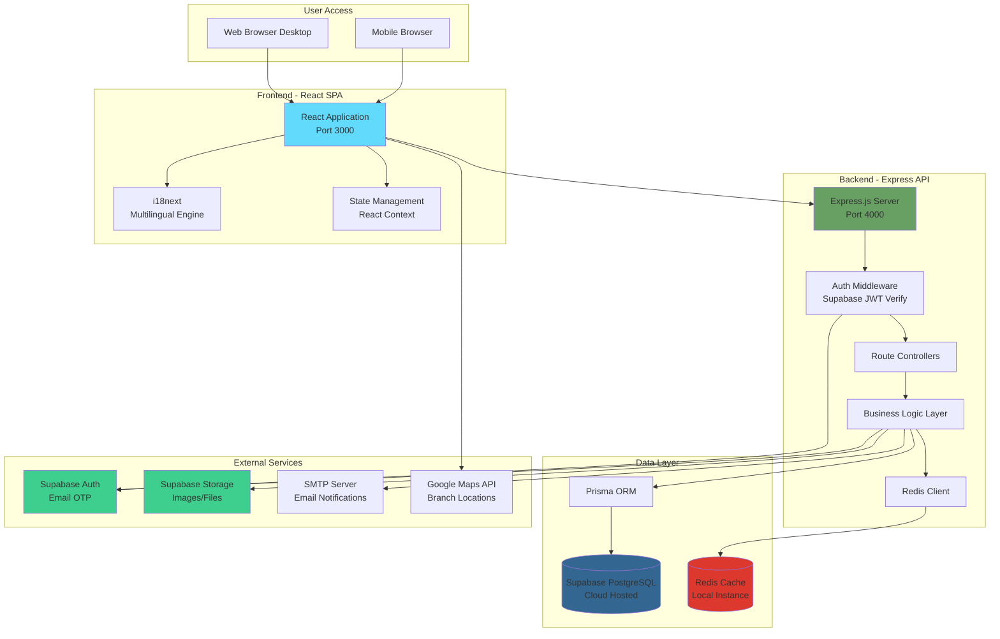

# High Level Architecture

### Technical Summary

The Beauty Clinic Care Website is built as a modern **monorepo fullstack application** with a clear separation between frontend (React SPA) and backend (Express.js RESTful API). The architecture follows a **modular monolith** pattern for the MVP, deployed locally for development and initial rollout, with infrastructure designed to support future cloud migration. 

The frontend leverages **React 18 + Vite 5** with Tailwind CSS and shadcn/ui for a premium, mobile-first user experience. **Vite** provides lightning-fast Hot Module Replacement (HMR) during development and optimized production builds with automatic code splitting. The backend uses **Node.js/Express.js** with **Prisma ORM** for type-safe database access to **Supabase PostgreSQL**. Authentication is handled entirely by **Supabase Auth** using passwordless email OTP, eliminating the need for custom auth logic. **Redis** provides high-performance caching for service listings, availability checks, and session data. 

The system supports **dual booking flows** (guest and member), comprehensive **multilingual content** (4 languages via i18next), and a rich **admin portal** for operations management. The architecture prioritizes developer experience through strong typing (TypeScript throughout), comprehensive testing (Jest + React Testing Library + Supertest), and clear API contracts. This design achieves the PRD's core goals: 60% online booking rate, 24/7 availability, and seamless multilingual support.

### Platform and Infrastructure Choice

**Platform:** Local Development Environment (MVP) → Cloud-Ready Architecture (Phase 2)

**Rationale:** The PRD explicitly specifies local deployment for the MVP phase. This architectural decision provides:
- **Rapid Development:** No cloud provider dependencies or account setup during initial development
- **Cost Efficiency:** Zero hosting costs during MVP validation period
- **Full Control:** Complete environment control for testing and iteration
- **Cloud Readiness:** Architecture designed with cloud deployment patterns (containerization-ready, stateless API, external services)

**Key Services:**

| Service | Technology | Location | Purpose |
|---------|-----------|----------|---------|
| **Database** | PostgreSQL 15+ | Supabase Cloud (accessed locally) | Primary data store for all entities |
| **Cache** | Redis 7+ | Local instance | Session management, availability caching, rate limiting |
| **Authentication** | Supabase Auth | Supabase Cloud | Email OTP authentication, session management |
| **File Storage** | Supabase Storage | Supabase Cloud | Service images, blog photos, branch images |
| **Email Service** | SMTP (configurable) | Local/External provider | Booking confirmations, OTP codes, contact form |

**Future Cloud Migration Options (Phase 2):**
- **Vercel + Supabase:** Optimal for rapid deployment, built-in CDN, serverless functions
- **AWS:** ECS/EKS for containers, RDS for PostgreSQL (if migrating off Supabase), ElastiCache for Redis
- **Azure:** App Service, Azure Database for PostgreSQL, Azure Cache for Redis

### Repository Structure

**Structure:** Monorepo (Single Repository, Multiple Packages)

**Monorepo Tool:** npm workspaces (Node.js native, zero additional dependencies)

**Rationale:**
- **Simplicity:** npm workspaces is built into Node.js 16+, no additional tooling required
- **Type Sharing:** Shared TypeScript interfaces between frontend and backend ensure API contract consistency
- **Atomic Changes:** Single PR can update API and frontend consumers simultaneously
- **Local Development:** Single `npm install` at root sets up entire project
- **Future-Proof:** Easy migration to Turborepo or Nx if caching/orchestration needs grow

**Package Organization:**

```
bapp/
├── frontend/                    # React + Vite frontend application
│   ├── src/
│   │   ├── components/          # Reusable UI components
│   │   │   ├── ui/              # Basic UI elements (Button, Input, etc.)
│   │   │   ├── features/        # Business logic components
│   │   │   └── common/          # Shared layout components
│   │   ├── pages/               # Route-level components
│   │   ├── hooks/               # Custom React hooks
│   │   ├── services/            # API integration layer
│   │   ├── utils/               # Helper functions and utilities
│   │   ├── types/               # TypeScript type definitions
│   │   └── styles/              # Global styles and Tailwind config
│   └── public/                  # Static assets
├── backend/                     # Node.js + Express backend API
│   ├── src/
│   │   ├── controllers/         # Request/response handling
│   │   ├── middleware/          # Request processing middleware
│   │   ├── models/              # Database models and schemas
│   │   ├── routes/              # API route definitions
│   │   ├── services/            # Business logic layer
│   │   ├── utils/               # Utility functions
│   │   ├── config/              # Configuration files
│   │   └── types/               # TypeScript type definitions
│   └── logs/                    # Application logs (production)
└── package.json                 # Root package.json with workspace scripts
```

**Shared Code Strategy:**
- **Types:** API request/response interfaces, data models, enums
- **Constants:** Service categories, booking statuses, error codes, language codes
- **Utilities:** Date formatting, currency formatting, validation helpers
- **Database:** Single Prisma schema shared across API and potential admin tools

### High Level Architecture Diagram



### Architectural Patterns

**1. Modular Monolith Architecture**
- Single deployable backend application with clear internal module boundaries
- _Rationale:_ Local deployment requirement and team size (2 developers) make microservices premature. Modular structure allows future extraction into services if needed.

**2. RESTful API with Resource-Based Routing**
- HTTP verbs (GET, POST, PUT, DELETE) map to CRUD operations
- Resource-centric URLs (e.g., `/api/v1/services`, `/api/v1/bookings`)
- _Rationale:_ REST is well-understood, tooling-mature, and sufficient for CRUD-heavy booking system. GraphQL or tRPC would add complexity without clear benefit for this use case.

**3. Single Page Application (SPA) with Client-Side Routing**
- React Router v6 handles navigation without page reloads
- Lazy loading for route-based code splitting
- _Rationale:_ Provides app-like experience crucial for booking flow. No SEO requirement for booking pages (public pages use static rendering where needed).

**4. Repository Pattern for Data Access**
- Services layer never calls Prisma directly; always through repository abstractions
- _Rationale:_ Testability (mock repositories), potential future database migration, separation of business logic from data access.

**5. JWT Token-Based Authentication (Supabase-Managed)**
- Supabase Auth issues JWT tokens after email OTP verification
- API middleware validates tokens on protected routes
- _Rationale:_ Stateless authentication scales horizontally, Supabase handles security best practices (token rotation, secure storage).

**6. Component-Based UI with Atomic Design Principles**
- shadcn/ui provides base components (atoms/molecules)
- Custom business components (organisms) composed from shadcn primitives
- Page-level components orchestrate full features
- _Rationale:_ Reusability, maintainability, and consistency across 21+ screens. shadcn's copy-paste model allows full customization.

**7. Service Layer Pattern**
- Controllers handle HTTP concerns (request/response)
- Services contain business logic (validation, orchestration, transactions)
- Clear separation of concerns
- _Rationale:_ Testable business logic, reusable across different controllers, easier to reason about.

**8. API Gateway Pattern (Future)**
- Currently: Direct frontend → backend communication
- Future: Introduce API Gateway (e.g., Kong, AWS API Gateway) when moving to cloud
- _Rationale:_ MVP simplicity now, but architecture supports adding gateway layer for rate limiting, analytics, and request transformation in Phase 2.

**9. Feature-Based Code Organization**
- Frontend: Organize by feature (booking/, services/, admin/) rather than type (components/, hooks/)
- Backend: Organize by domain (bookings/, services/, users/) rather than layer (controllers/, services/)
- _Rationale:_ Related code stays together, easier to understand feature scope, supports potential future service extraction.

**10. Cache-Aside Pattern**
- Application checks cache first, queries database on miss, updates cache
- Redis caching for: service listings, branch data, availability windows, i18n translations
- _Rationale:_ Reduces database load for high-read, low-write data (services, branches). Availability cache with short TTL (5 min) balances freshness with performance.

---

